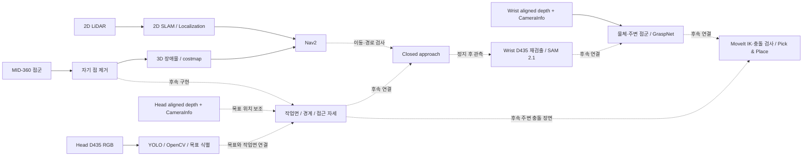

<div align="center">

# INHA United @Home · 2027

**인하 유나이티드 앳홈 2기 · RoboCup@Home 로봇 개발**

TRACER × PiPER · Calibration · Detection · Simulation


[Jetson 설치 기록](setup/jetson/README_SETUP.md) · [실행 명령](setup/jetson/RUN_COMMANDS.md) · [가상환경](setup/jetson/VIRTUAL_ENVIRONMENTS.md) · [하드웨어](HW/URDF/README.md) · [시뮬레이션](simulation/README.md)

</div>

이 저장소는 로봇의 **CAD·메시, 통합 URDF, Gazebo 시뮬레이션, 인지 설계와 Jetson 운영 문서**를 관리합니다. 실제 센서 드라이버와 모델은 Jetson 홈 디렉터리의 개별 워크스페이스에 설치돼 있습니다.

> [!IMPORTANT]
> **Jetson 설정 기준: 2026-10-03.** YOLO와 SAM의 실제 GPU 샘플 추론, ROS 통신, 네 워크스페이스의 핵심 빌드를 확인했습니다. 카메라용 apt 일부와 실기 입력은 남아 있으며, 실제 보정·물체 학습·자율 주행·파지를 완료한 상태는 아닙니다.

## 처음 합류했다면

| 알고 싶은 것 | 읽을 문서 |
| --- | --- |
| 이 로봇과 저장소의 전체 구성 | 아래 [로봇 구성](#로봇-구성)과 [파일 구조](#파일-구조) |
| 어떤 Python / 가상환경을 사용할지 | [가상환경 선택](#가상환경-선택) → [환경별 상세 사용법](setup/jetson/VIRTUAL_ENVIRONMENTS.md) |
| 오늘 바로 모델을 실행하는 방법 | [Jetson 빠른 시작](#jetson-빠른-시작) |
| 카메라·PiPER·LiDAR·보정·bag 터미널 명령 | [RUN_COMMANDS.md](setup/jetson/RUN_COMMANDS.md) |
| 설치된 버전, 소스 commit, 모델 checksum | [VERSIONS.md](setup/jetson/VERSIONS.md) |
| 아직 필요한 실측값과 장치 설정 | [CONFIG_REQUIRED.md](setup/jetson/CONFIG_REQUIRED.md) |
| 확인한 범위와 미완료 항목 | [SETUP_REPORT.md](setup/jetson/SETUP_REPORT.md) |
| Gazebo 모델을 실행하거나 수정하는 방법 | [Simulation](simulation/README.md) / [Hardware](HW/URDF/README.md) |
| 손목 탑다운 관측과 MuJoCo 물리 픽앤플레이스 재현 | [Manipulation 튜토리얼](simulation/mujoco/README.md) |
| 인지·분할·파지의 후속 설계 | [Detection 설계](detection/README.md) |
| 2D LiDAR·두 D435·Mid-360의 역할 | [센서 역할과 접근 설계](detection/SENSOR_ROLES.md) |
| 헤드 검출·ROI 추적 ROS 코드와 Docker 실행 | [헤드 검출 구현 가이드](detection/HEAD_DETECTION.md) |

## 로봇 구성

**2026-10-05 센서 선택: Head D435 + Wrist D435.** Mid-360은 주변 3D 환경의 기하를 관측한다. [센서별 역할·구현 우선순위](detection/SENSOR_ROLES.md)를 기준으로 개발하며, 두 카메라의 실제 연결·보정·관측 품질은 별도로 확인한다.

| 구성 | 현재 선택·실기 준비 | 담당 역할 |
| --- | --- | --- |
| 차체 | **AgileX original TRACER** | 이동 플랫폼. TRACER 2 / Mini와 구분 |
| 상부 구조 | 프로파일로 제작한 플랫폼 | 팔과 고정 센서 장착 |
| 매니퓰레이터 | **AgileX PiPER** | 손목 관측·파지 준비. 실제 CAN과 펌웨어 확인 필요 |
| Head camera | **RealSense D435** | 넓은 공간 관측, RGB 검출, aligned depth |
| Wrist camera | **RealSense D435** | 접근 후 재검출, 근거리 RGB-D와 정밀 분할 |
| 고정 3D LiDAR | **Livox MID-360** | 3D 장애물 감지·작업면 기하·근접 접근 자세 생성; 이후 주변 충돌 장면 |
| 주행용 2D LiDAR | **실물 모델 미확정** | 2D SLAM·위치 추정과 Nav2 기본 입력. 모델 확인 후 공식 드라이버 선택 |

### CAD·시뮬레이션과 실기를 대조할 때

| 항목 | 저장소의 기존 CAD / Gazebo | 현재 Jetson 실기 준비 |
| --- | --- | --- |
| 카메라 | Head / Wrist D435f 형상·핀홀 근사 | Head D435 / Wrist D435 |
| LiDAR | YDLIDAR G2 / Mid-360S 모델 | 2D 모델 미확정 / MID-360 |
| SAM | 기존 Detection 설계는 Small 평가안 | **SAM 2.1 Hiera Tiny GPU** 설치·추론 확인 |
| 3D 위치 | 기존 설계는 LiDAR 영상 투영·융합 | 초기 실습은 **RealSense aligned depth** |
| 관절 입력 | Gazebo `/joint_states` | 실기 `/piper/joint_states_feedback` |
| 외부 TF | CAD 배치값 | 실제 hand–eye·장착·TCP 보정값 필요 |

CAD 형상·시뮬레이션 수치를 실측 보정값으로 사용하지 않습니다. 실제 RealSense의 내부 TF와 intrinsic은 드라이버에서 받고, 외부 장착 TF는 실측·보정 후 연결합니다.

## Jetson 환경과 현재 상태

### 기본 플랫폼

| 항목 | 실제 확인값 |
| --- | --- |
| 보드 | NVIDIA **Jetson AGX Orin Developer Kit** |
| OS / 아키텍처 | Ubuntu **22.04.5 Jammy** / `aarch64` (`arm64`) |
| JetPack / L4T | **6.2.3+b81 / 36.5.2** |
| RAM / swap | 약 **29 GiB / 14 GiB** |
| GPU / 드라이버 | Orin / **540.5.0** |
| CUDA / cuDNN | **12.6 / 9.3.0.75** |
| ROS / 시스템 Python | **ROS 2 Humble Desktop / Python 3.10.12** |
| GPU PyTorch 조합 | **torch 2.8.0 + torchvision 0.23.0**, Orin `sm_87` |
| 패키지 관리자 | Ubuntu/ROS `apt`, 모델 환경 `uv 0.12.22` |

GPU wheel은 [Jetson AI Lab의 JetPack 6 / CUDA 12.6 index](https://pypi.jetson-ai-lab.io/jp6/cu126/+simple/)에서 받아 두 환경에 적용했습니다. 기존 NVIDIA 드라이버와 CUDA를 재사용합니다. Jetson은 ARM64이므로 일반 PC용 `x86_64` wheel·Docker 이미지를 그대로 사용할 수 없습니다.

### 완료 범위

| 구성 | 상태 | 확인한 내용 |
| --- | --- | --- |
| ROS Humble / RViz / TF / rosbag2 | `VERIFIED_SOFTWARE` | 설치·import·CLI·짧은 talker/listener 통신. GUI 화면 미검증 |
| `calibration_ws` | `VERIFIED_SOFTWARE` + `CONFIGURE_REQUIRED` | easy_handeye2와 메시지 빌드, 서비스/launch 확인 |
| `piper_ros` | `VERIFIED_SOFTWARE` + `CONFIGURE_REQUIRED` | SDK import, piper / msgs / description 빌드. CAN feedback 미확인 |
| `ws_livox` | `VERIFIED_SOFTWARE` + `CONFIGURE_REQUIRED` | SDK2 및 ROS driver2 빌드. 실제 점군 미확인 |
| `detection_ws` / YOLO | `VERIFIED_SOFTWARE` | ROS 노드 빌드, GPU detection·segmentation 샘플 추론 |
| SAM 2.1 / Jupyter | `VERIFIED_SOFTWARE` | Tiny 모델 GPU point·box 분할, 전용 kernel 준비 |
| TCP Pivot | `VERIFIED_SOFTWARE` + `CONFIGURE_REQUIRED` | 도구 설치·help 확인. 실측 pose 입력 필요 |
| RealSense / AprilTag / image tools | `BLOCKED` | 관련 apt 설치와 실제 카메라 입력 필요 |
| Koide | `CONFIGURE_REQUIRED` + `BLOCKED` | **설정만 준비**. 확인한 Humble Docker 이미지는 amd64 전용 |
| 사용자 물체 학습 / 실시간 통합 | `CONFIGURE_REQUIRED` | 데이터·class·보정·연결 구현 필요 |

`VERIFIED_SOFTWARE`는 설치·빌드·소프트웨어 확인, `VERIFIED_HARDWARE`는 실제 장치 확인, `CONFIGURE_REQUIRED`는 입력/설정 필요, `BLOCKED`는 진행을 막는 조건을 뜻합니다. GPU 연산은 확인했고, 로봇 센서·구동계의 읽기 검증은 아직 완료하지 않았습니다.

## 파일 구조

### 이 Git 저장소

```text
INHA-RoboCup-Home-2th-2027/
├── README.md                         # 프로젝트 입구 / Jetson 핵심 안내
├── HW/
│   └── URDF/
│       ├── README.md                 # 메시·CAD 자료 안내
│       ├── WRIST_CAMERA_INTEGRATION.md
│       ├── tracer/                   # 차체·바퀴 메시 / 물성 기록
│       ├── piper/                    # 팔·그리퍼 메시 / upstream LICENSE
│       ├── sensor_rack_description/  # 프로파일·센서 메시 / CAD 보고서
│       └── wrist_camera_description/ # 손목 마운트·카메라 / STEP·배치 자료
├── simulation/
│   ├── robot_description/robocup.urdf # 유일한 통합 URDF: 89 links / 88 joints
│   ├── gazebo/                       # world 생성 / Gazebo 실행
│   ├── ros2/                         # ROS bridge·RViz·SLAM/Nav2 설정
│   ├── tools/                        # Gazebo 제어·카메라·센서 검사 도구
│   └── docs/                         # 조립 좌표 / 센서 근사·검증 기록
├── detection/README.md               # 후속 인지·파지 설계
└── setup/
    ├── README.md                     # 개발 PC / Jetson 설치 안내
    ├── install_ros2_gz.sh             # 기존 Ubuntu 22.04 설치 스크립트
    └── jetson/                       # 현재 Jetson 설치·실행 문서 6종
```

`robocup.urdf`는 `HW/URDF/`의 메시를 상대 경로로 참조하므로 **저장소 전체를 함께 받아야 합니다.** `simulation/gazebo/build/`는 실행 때 생성되는 산출물입니다. `slam_params.yaml` / `nav2_params.yaml`의 존재는 Jetson에 SLAM·Nav2가 설치·통합됐다는 의미가 아닙니다.

### Jetson에 설치된 실제 작업 경로

현재 사용자의 `$HOME`은 `/home/sparo`입니다. 아래 경로는 **이 PC의 홈 디렉터리**이며, 저장소를 clone한다고 생성되는 폴더는 아닙니다.

```text
~/
├── INHA-RoboCup-Home-2th-2027/        # 팀 저장소 checkout
├── robot_setup/                     # 설치 문서 / 설정 입력 / 로그 / 다운로드
│   ├── downloads/gpu-wheels/        # torch / torchvision ARM64 GPU wheel
│   ├── apt-cache/                   # 남은 apt .deb / 패키지 목록
│   ├── piper-python/                # PiPER SDK용 Python prefix
│   ├── ros-python/                  # transforms3d용 Python prefix
│   ├── colcon-python/               # YOLO 빌드 전용 setuptools
│   ├── livox-sdk2/                  # 사용자 경로에 설치한 SDK2
│   ├── setup_inputs.yaml            # 실제 장치·실측값 입력
│   └── logs/                        # 설치·빌드·GPU 추론 확인 기록
├── calibration_ws/                  # easy_handeye2
│   ├── src/                         # 공식 source
│   ├── config/                      # Head / Wrist YAML, 태그, Livox 설정
│   ├── results/                     # 작업 결과 보관
│   └── build/ · install/ · log/      # colcon 산출물
├── piper_ros/                       # 공식 Humble source / core build
├── ws_livox/                        # livox_ros_driver2 workspace
├── calibration_data/
│   ├── head/ · wrist/ · tcp/ · base_arm/ · base_laser/
│   └── head_mid360/
│       └── bags/ · processed/ · validation/ · validation_processed/
├── detection_ws/
│   ├── src/yolo_ros/yolo_ros/.venv/  # YOLO GPU 전용 venv
│   └── build/ · install/ · log/      # yolo_msgs / yolo_ros / yolo_bringup
├── detection_tools/sam2/            # pinned 공식 SAM2 source
├── venvs/
│   ├── sam21/                       # SAM GPU / Jupyter
│   └── pivot/                       # TCP Pivot
├── detection_data/
│   ├── models/                      # YOLO11n / YOLO11n-seg / SAM 2.1 Tiny
│   ├── samples/                     # 공식 샘플 / SAM 작업용 notebook
│   ├── images/ · results/ · bags/
│   └── datasets/known_objects/
│       ├── raw/                     # 촬영 원본
│       ├── images/{train,val,test}/
│       ├── labels/{train,val,test}/
│       └── data.yaml                # 실제 class 입력 전 템플릿
└── Desktop/결과.md                  # 이 PC의 전체 setup 결과
```

모델, venv, wheel, `.deb`, bag와 설치 로그는 Jetson 로컬에 보관합니다. Git에는 팀 문서와 개발 소스를 관리합니다. easy_handeye2의 실제 저장 서비스는 `~/.ros2/easy_handeye2/{calibrations,samples}/`에 결과를 저장하므로 작업용 `results/`와 구분합니다.

## 가상환경 선택

| 작업 | Python 환경 | 시작 방법 |
| --- | --- | --- |
| ROS / 센서 / PiPER / 보정 / colcon | `/usr/bin/python3` + Humble | ROS와 필요한 workspace를 `source` |
| YOLO CLI 검출·분할·학습 | `~/detection_ws/src/yolo_ros/yolo_ros/.venv` | venv `activate` 또는 CLI 절대 경로 |
| YOLO **ROS 노드** | ROS shell + 노드의 YOLO venv interpreter | venv activate 없이 ROS / detection overlay source |
| SAM / Jupyter | `~/venvs/sam21` | venv activate, **SAM 2.1 (Jetson GPU Python 3.10)** kernel |
| TCP Pivot | `~/venvs/pivot` | venv activate 후 `sksPivotCalibration` |
| PiPER SDK / transforms3d | 시스템 Python + 사용자 prefix | 해당 `PYTHONPATH` 설정 |

YOLO와 SAM은 모두 **torch 2.8.0 / torchvision 0.23.0 / CUDA 12.6 / NumPy 1.26.4**를 사용합니다. YOLO는 **ultralytics 8.4.6**, 시스템 ROS는 **NumPy 1.21.5 / OpenCV 4.5.4**입니다. 시스템 Python에 torch는 전역 설치하지 않았습니다.

환경을 바꿀 때는 `deactivate`하거나 새 터미널을 엽니다. ROS colcon 빌드는 시스템 Python으로 진행하고 모델 venv를 겹쳐 activate하지 않습니다. YOLO venv는 `--system-site-packages`로 만들어 ROS apt 모듈을 사용할 수 있습니다. `sudo pip`나 전역 NumPy 2 업그레이드 대신 각 환경의 고정 버전을 유지합니다.

> [!NOTE]
> YOLO의 `pyproject.toml`은 로컬 GPU wheel을 `/home/sparo/robot_setup/downloads/gpu-wheels/`의 `file://` URL로 참조합니다. wheel을 유지해야 하며, 다른 PC에서는 사용자 경로와 JetPack/CUDA 조합을 맞춰야 합니다. YOLO ROS는 setuptools 65.5.1 사용자 prefix로 **일반 colcon install**하여 노드 shebang을 GPU venv에 연결했습니다. 자세한 재빌드는 [설치 기록](setup/jetson/README_SETUP.md)을 참고하세요.

## Jetson 빠른 시작

### 1. YOLO GPU 샘플

현재 설치된 환경에서 바로 실행할 수 있습니다.

```bash
source ~/detection_ws/src/yolo_ros/yolo_ros/.venv/bin/activate
yolo predict model=$HOME/detection_data/models/yolo11n.pt \
  source=$HOME/detection_data/samples/bus.jpg device=0 \
  save=True save_txt=True project=$HOME/detection_data/results name=quickstart_detect
deactivate
```

분할은 `model=$HOME/detection_data/models/yolo11n-seg.pt`로 바꿉니다. 결과 이미지와 labels는 `~/detection_data/results/`의 해당 run 폴더에 생성됩니다. 기존에 확인한 GPU 결과는 `yolo_detect_gpu/`, `yolo_segment_gpu/`, `sam21_gpu/`에 있습니다.

### 2. SAM 2.1 GPU notebook

새 터미널에서 실행합니다.

```bash
source ~/venvs/sam21/bin/activate
jupyter lab --ip=127.0.0.1 --no-browser --notebook-dir=$HOME/detection_data/samples
```

터미널에 출력된 인증 URL을 브라우저에서 열고 `image_predictor_example_sam21_tiny.ipynb`를 선택합니다. kernel은 **SAM 2.1 (Jetson GPU Python 3.10)**, 모델은 `sam2.1_hiera_tiny.pt` + `configs/sam2.1/sam2.1_hiera_t.yaml`, device는 `cuda`입니다. 종료는 `Ctrl+C` 후 `deactivate`입니다.

SAM 이미지 분할은 준비됐으며 ROS mask publisher는 후속 구현입니다. 선택적 CUDA extension은 빌드하지 않았고, `eva-decord`의 Linux ARM64 배포가 없어 영상 notebook extras 일부는 미설치입니다.

### 3. ROS 작업 터미널

모델 venv를 activate하지 않은 새 터미널에서 **Humble → 필요한 workspace** 순서로 source합니다. 아래는 전체 작업에 필요한 overlay 순서입니다. 사용하지 않는 workspace 줄은 생략할 수 있습니다.

```bash
source /opt/ros/humble/setup.bash
source ~/piper_ros/install/local_setup.bash
source ~/calibration_ws/install/local_setup.bash
source ~/ws_livox/install/local_setup.bash
source ~/detection_ws/install/local_setup.bash
export PYTHONPATH="$HOME/robot_setup/ros-python:$HOME/robot_setup/piper-python${PYTHONPATH:+:$PYTHONPATH}"
export LD_LIBRARY_PATH="$HOME/robot_setup/livox-sdk2/lib${LD_LIBRARY_PATH:+:$LD_LIBRARY_PATH}"

ros2 node list
ros2 topic list -t
```

센서/보정 노드는 실제 serial·CAN·태그 크기·IP를 채운 뒤 [터미널별 직접 명령](setup/jetson/RUN_COMMANDS.md)으로 시작합니다. 각 foreground 프로세스는 해당 터미널의 `Ctrl+C`로 종료합니다.

### 4. GPU와 환경이 헷갈릴 때

YOLO 또는 SAM venv를 activate한 상태에서만 확인합니다.

```bash
which python
python -c 'import torch; print(torch.__version__, torch.version.cuda, torch.cuda.is_available()); print(torch.cuda.get_device_name(0) if torch.cuda.is_available() else "CUDA unavailable")'
```

현재 두 venv에서 `2.8.0`, `12.6`, `True`, Orin GPU를 확인했습니다. 시스템 Python에서 `import torch`가 안 되는 것은 이 환경 구성에서 정상입니다. 문제별 확인 방법은 [환경 문서](setup/jetson/VIRTUAL_ENVIRONMENTS.md)에 있습니다.

## 센서 입력과 보정 흐름

**2D LiDAR는 위치 추정·주행, Mid-360은 환경 기하, Head D435는 목표 식별·추적, Wrist D435는 물체 관측·파지 입력**을 담당합니다.



Mid-360의 Nav2 장애물 소스와 자기 점 필터는 **시뮬레이션 코드·설정에 존재**합니다. 점선의 작업면 추출·접근 자세·자동 접근·손목 파지 연결은 후속 구현이며, 위 그림이 실기 통합 완료를 뜻하지 않습니다. 자세한 입력·상태·우선순위는 [센서 역할 문서](detection/SENSOR_ROLES.md)에 있습니다.

| 입력 / 출력 | 준비할 이름 | 상태 / 주의 |
| --- | --- | --- |
| Head RGB | `/sensors/head/color/image_raw` | RealSense 연결 후 실제 이름·QoS 확인 |
| Head aligned depth | `/sensors/head/aligned_depth_to_color/image_raw` | 해당 CameraInfo와 함께 사용 |
| Wrist RGB / depth | `/sensors/wrist/color/image_raw`, `/sensors/wrist/aligned_depth_to_color/image_raw` | D435 profile·serial 확인 |
| LiDAR | `/livox/lidar` / `livox_frame` | `PointCloud2` + `intensity` 확인 필요 |
| PiPER feedback | `/piper/joint_states_feedback` | 제조사 읽기 노드 출력 remap. command 값과 구분 |
| YOLO namespace | `head_yolo`, `wrist_yolo` | 실제 launch 인자는 실행 문서 참고 |
| Hand–eye | Head `eye_on_base`, Wrist `eye_in_hand` | `piper/base_link`, `piper/link6` feedback TF 필요 |

**Depth 단위:** `16UC1`은 mm이므로 m로 변환할 때 `/1000`; `32FC1`은 이미 m입니다. YOLO `use_3d`의 입력은 depth image이며 `/livox/lidar` 점군을 depth 인자에 넣지 않습니다. RealSense `enable_sync`는 두 카메라 사이 하드웨어 동기화를 보장하지 않습니다. YOLO polygon과 SAM의 H×W 픽셀 mask도 구분해야 합니다.

실제 보정 후 연결할 TF는 다음과 같습니다. 이 표는 연결 계획이며 미보정 identity TF를 발행하지 않습니다.

| parent → child | 변환의 출처 |
| --- | --- |
| `base_link` → `piper/base_link` | 차체–팔 장착 CAD 대조·실측 |
| `piper/base_link` → `piper/link6` | 펌웨어 대응 제조사 URDF + 실제 관절 feedback |
| `piper/base_link` → `head_link` | Head hand–eye 결과 |
| `piper/link6` → `wrist_link` | Wrist hand–eye 결과 |
| 카메라 optical frame → `livox_frame` | Koide 결과의 방향 확인·필요한 역변환 |
| flange → TCP | 실제 TCP 위치·방향 / pivot 입력 |

## 남은 설정과 다음 단계

### 실기 전에 채울 입력

1. **공통 apt 마무리:** RealSense / AprilTag / image tools 등 요청 패키지 15개가 미설치입니다. `.deb` cache 약 427 MiB는 로컬에 준비돼 있습니다. [설치 기록](setup/jetson/README_SETUP.md)의 남은 패키지 명령으로 진행합니다.
2. **카메라:** Head/Wrist 두 D435의 실제 serial, USB 연결 속도, 지원 profile, topic/frame/QoS.
3. **팔·차체:** PiPER / TRACER CAN 구분, PiPER 펌웨어와 old/new URDF, 실제 feedback.
4. **LiDAR:** 실제 NIC / host IP / MID-360 IP, 2D LiDAR 모델. 기록된 `192.168.1.184`는 확인할 센서 후보이고, 관측된 host `eno1=192.168.50.184/24`와 구분합니다.
5. **보정·학습:** 태그 검은 외곽 한 변[m], 장착·TCP 실측, 독립 validation bag, 물체 class와 촬영 세션별 split.

### 지정 물체 학습 준비

`~/detection_data/datasets/known_objects/data.yaml`의 `names`는 실제 클래스 입력 전 비어 있습니다. [makesense.ai](https://www.makesense.ai/)에서 YOLO bbox 형식으로 export하고, 라벨은 `class_id cx cy w h`의 **0–1 정규화 좌표**를 사용합니다. train/val/test는 촬영 세션별로 나누며 같은 연속 프레임을 split 사이에 섞지 않습니다.

현재 범위는 **YOLO detection 학습 환경 + 사전학습 SAM 사용**입니다. bbox 학습, YOLO segmentation 학습, SAM fine-tuning은 각각 별도 작업입니다. 사용자 데이터가 없어 실제 fine-tuning은 실행하지 않았습니다. [학습·평가·resume 명령](setup/jetson/RUN_COMMANDS.md#11-known_objects-yolo-detection-학습)을 참고하세요.

### 후속 개발

- 실기 센서의 영상·점군·feedback 읽기 확인과 실제 보정
- MID-360 3D 장애물 입력의 실기 연결 → 작업면·경계 추출 → 근접 접근 자세 생성
- 필요할 때 Head–LiDAR 투영으로 목표와 작업면 연결, 이후 MoveIt 주변 충돌 장면
- SAM ROS mask publisher와 관측 시각의 TF 연결
- Nav2 / MoveIt / GraspNet 통합과 로봇 자동 접근·파지

2D LiDAR를 주행 SLAM의 우선 입력으로 두며 FAST-LIO / FAST-LIO2는 설치하지 않았습니다. Koide는 기존 경험을 전제로 소스·경로·명령만 준비했습니다. 이 Jetson에서 Docker/이미지 pull/무거운 Koide build는 수행하지 않았습니다.

## 시뮬레이션과 개발 자료

Gazebo 개발 환경이 준비된 PC에서는 저장소 루트에서 아래 기존 명령을 사용합니다.

```bash
./simulation/gazebo/start_sim.sh --world room
# 다른 터미널
python3 simulation/tools/camera_view.py --partition robocup_motion --camera head
python3 simulation/tools/camera_view.py --partition robocup_motion --camera wrist
```

**현재 Jetson에는 Gazebo와 `robotctl` / `robot-camera` / `robot-joystick` 단축 명령을 설치하지 않았습니다.** 위 명령은 Gazebo Harmonic과 Python transport/GUI 의존성이 있는 개발 PC용입니다. 설치 스크립트는 [setup 안내](setup/README.md)를 먼저 읽고 사용합니다. 실기 ROS와 시뮬레이션의 topic/frame/`use_sim_time`을 대조해야 합니다.

| 자료 | 위치 |
| --- | --- |
| 통합 모델 / 물성 / 링크 연결 | [robot_description](simulation/robot_description/README.md) |
| Gazebo 실행 / 센서 수신 | [gazebo](simulation/gazebo/README.md) |
| 조이스틱 / 터미널 제어 / 카메라 | [tools](simulation/tools/README.md) |
| ROS bridge / RViz | [ros2](simulation/ros2/README.md) |
| CAD 장착 좌표 / 센서 모델 한계 | [ASSEMBLY](simulation/docs/ASSEMBLY.md) / [SENSORS](simulation/docs/SENSORS.md) |
| 손목 장착 원본과 정합 기록 | [wrist_camera_description](HW/URDF/wrist_camera_description/README.md) |

## 문서와 결과를 갱신할 때

이 Jetson의 팀 저장소는 `~/INHA-RoboCup-Home-2th-2027`에 있습니다. 작업 전 변경사항을 확인하고 최신 문서를 받습니다.

```bash
cd ~/INHA-RoboCup-Home-2th-2027
git status
git pull --ff-only origin main
```

로컬 수정사항이 있거나 fast-forward가 불가능하면 수정 내용을 보존하고 변경 이력을 확인합니다. GitHub HTTPS 인증은 `gh auth status`로 확인할 수 있습니다.

버전·설치 경로가 바뀌면 `setup/jetson/VERSIONS.md`, 실행 명령은 `RUN_COMMANDS.md`, 확인 범위는 `SETUP_REPORT.md`를 함께 갱신합니다. 설치 성공·시뮬레이션 검증·실기 보정 결과를 구분하고, 실제 결과는 촬영 세션·입력 데이터·검증 조건과 함께 기록합니다.

Jetson 원본 기록은 `~/robot_setup/`와 `~/Desktop/결과.md`에 있습니다. 저장소의 Jetson 문서는 2026-10-03 상태를 팀원과 공유한 사본입니다. 모델 weight·bag·venv·빌드 폴더는 로컬에 유지하며, 인증 토큰·비밀번호는 문서에 기록하지 않습니다.
