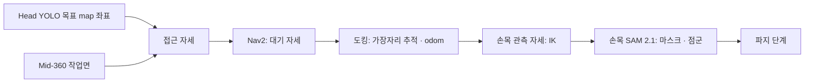

# Closed approach · 헤드 검출부터 손목 재관측까지

헤드 카메라가 찾은 목표 앞으로 로봇을 붙이고, 팔을 들어 손목 카메라로 같은 물체를 다시 관측합니다. 출력은 `base_link` 기준의 물체 위치와 점군이며, 이후 GraspNet·MoveIt 파지가 이어받습니다.



[센서 역할](SENSOR_ROLES.md) · [작업면 추출](SUPPORT_SURFACES.md) · [헤드 검출·Nav2 테스트](head/SIM_NAV_TEST.md)

## 실행 (Gazebo 방 world)

[SIM_NAV_TEST](head/SIM_NAV_TEST.md)대로 Gazebo·SLAM·Nav2를 띄우고, 로봇을 0.5 m쯤 움직여 지도를 채운 뒤 테이블이 보이는 곳에서 헤드 검출(4절, `auto_send:=false`)을 실행합니다. 그리고:

```bash
ros2 launch robocup_head_detection closed_approach.launch.py
```

목표가 확정되면 접근·대기 자세를 계산해 발행합니다(이 PR 범위). 상태 토픽: `/detection/approach/status`. RViz 설정: [`SW/simulation/ros2/approach.rviz`](../simulation/ros2/approach.rviz).

## 1. 접근 자세

`approach_node` · [`approach_geometry.py`](head/head_detection_ws/src/robocup_head_detection/robocup_head_detection/approach_geometry.py)

1. 목표(`/detection/target_map_point`)를 담고 있는 작업면을 고릅니다(윤곽 안, 높이 0~0.4 m 위).
2. **확인된 변**(`edge_observed ≥ 0.5`)마다 로봇이 그 변을 정면으로 보고 서는 자세를 만듭니다. 목표가 `base_link` 기준 **앞 0.392 m, 오른쪽 0.078 m**에 오게 합니다. 파지 튜토리얼(MuJoCo·Gazebo)이 검증된 "close approach 완료" 장면입니다.
3. 그 거리를 지키면 가장자리에 0.08 m보다 붙어야 하는 깊은 물체는 0.08 m에서 멈추고 물체가 더 앞에 놓입니다. 테이블 다리 쪽 모서리 근처면 몸체가 다리를 비키도록 옆으로 옮깁니다.
4. 팔이 닿지 않는 후보는 버리고, 원하는 오프셋에 가장 가까운 후보를 고릅니다.

| 수치 | 값 | 근거 |
|---|---|---|
| 가장자리 최소 거리 | 0.08 m | 테이블 높이에서 로봇 최전방은 랙 앞기둥(`base_link` x +0.03). 차체·아래 랙(0.45 m 이하)은 상판 아래로 들어감 |
| 팔 도달(수직 하향 파지) | 정면 0.50 / 좌우 0.15 m에서 0.475 / 0.25 m에서 0.425 m | Piper IK, 2026-10-06 장착, 집게 축 0.11 m 지점 |
| 대기 자세 | 가장자리에서 0.6 m | Nav2 costmap 팽창 밖 |

출력: `/detection/approach/{stage_pose,dock_pose,dock_edge_distance,status,markers}`. 같은 목표(5 cm 이내)에 대해서는 새 계산이 실패해도 직전 계획을 유지합니다(`APPROACH_HELD`). 가까이 가면 가장자리 판정이 바뀌어도 계획이 흔들리지 않게 하기 위해서입니다.

## 제한

- **높이 기준:** URDF에 `base_footprint`가 없어 `map`·`odom`의 높이가 0.1425 m 낮습니다. 노드들은 `floor_z: -0.1425`로 보정합니다. `base_footprint`가 생기면 `0.0`으로 바꿉니다.
- 헤드 목표는 카메라 쪽 물체 앞면을 재므로 1~3 cm 치우칩니다.
- 도킹(2절)과 손목 관측(3절)은 후속 PR입니다.
