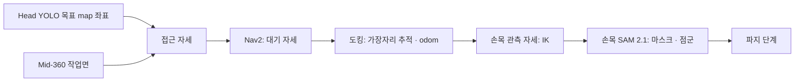

# Closed approach · 헤드 검출부터 손목 재관측까지

헤드 카메라가 찾은 목표 앞으로 로봇을 붙이고, 팔을 들어 손목 카메라로 같은 물체를 다시 관측합니다. 출력은 `base_link` 기준의 물체 위치와 점군이며, 이후 GraspNet·MoveIt 파지가 이어받습니다.



[센서 역할](SENSOR_ROLES.md) · [작업면 추출](SUPPORT_SURFACES.md) · [헤드 검출·Nav2 테스트](head/SIM_NAV_TEST.md)

## 실행 (Gazebo 방 world)

[SIM_NAV_TEST](head/SIM_NAV_TEST.md)대로 Gazebo·SLAM·Nav2를 띄우고, 로봇을 0.5 m쯤 움직여 지도를 채운 뒤 테이블이 보이는 곳에서 헤드 검출(4절, `auto_send:=false`)을 실행합니다. 그리고:

```bash
ros2 launch robocup_head_detection closed_approach.launch.py \
  python_executable:=$PWD/SW/detection/head/.venv-test/bin/python3 \
  sam_checkpoint:=$PWD/SW/detection/head/models/sam2.1_hiera_tiny.pt
```

목표가 확정되면 접근 → 도킹 → 손목 관측까지 자동으로 진행합니다. 상태 토픽: `/detection/approach/status`, `/detection/dock/status`, `/detection/wrist/observe_status`, `/detection/wrist/status`. RViz 설정: [`SW/simulation/ros2/approach.rviz`](../simulation/ros2/approach.rviz).

## 1. 접근 자세

`approach_node` · [`approach_geometry.py`](head/head_detection_ws/src/robocup_head_detection/robocup_head_detection/approach_geometry.py)

1. 목표(`/detection/target_map_point`)를 담고 있는 작업면을 고릅니다(윤곽 안, 높이 0~0.4 m 위).
2. **확인된 변**(`edge_observed ≥ 0.5`)마다 로봇이 그 변을 정면으로 보고 서는 자세를 만듭니다. 목표가 `base_link` 기준 **앞 0.392 m, 오른쪽 0.078 m**에 오게 합니다. 파지 튜토리얼(MuJoCo·Gazebo)이 검증된 "close approach 완료" 장면입니다.
3. 그 거리를 지키면 가장자리에 0.08 m보다 붙어야 하는 깊은 물체는 0.08 m에서 멈추고 물체가 더 앞에 놓입니다. 테이블 다리 쪽 모서리 근처면 몸체가 다리를 비키도록 옆으로 옮깁니다.
4. 팔이 닿지 않는 후보는 버리고, 원하는 오프셋에 가장 가까운 후보를 고릅니다.

| 수치 | 값 | 근거 |
|---|---|---|
| 가장자리 최소 거리 | 0.08 m | 테이블 높이에서 로봇 최전방은 랙 앞기둥(`base_link` x +0.03). 차체·아래 랙(0.45 m 이하)은 상판 아래로 들어감 |
| 팔 도달(수직 하향 파지) | 정면 0.50 / 좌우 0.15 m에서 0.475 / 0.25 m에서 0.425 m | Piper IK, 2026-10-06 장착, 집게 축 0.11 m 지점 |
| 대기 자세 | 가장자리에서 0.6 m | Nav2 costmap 팽창 밖 |

출력: `/detection/approach/{stage_pose,dock_pose,dock_edge_distance,status,markers}`. 같은 목표(5 cm 이내)에 대해서는 새 계산이 실패해도 직전 계획을 유지합니다(`APPROACH_HELD`). 가까이 가면 가장자리 판정이 바뀌어도 계획이 흔들리지 않게 하기 위해서입니다.

## 2. 도킹

`dock_node` · [`dock_geometry.py`](head/head_detection_ws/src/robocup_head_detection/robocup_head_detection/dock_geometry.py)

`NAV_TO_STAGE → MEASURING → DOCKING → DOCKED` (`/detection/dock/status`)

1. Nav2로 대기 자세에 갑니다(허용 오차 때문에 옆 0.2 m·방향 15°쯤 벗어나도 됨).
2. 정지한 채 1초 동안 Mid-360으로 **가장자리 직선**을 로봇 기준으로 잽니다: 옆 방향 5 cm 구간마다 가장 가까운 윗면 점 → Theil–Sen 시작 + 이상점 제외 최소제곱. 물체가 가린 구간은 빠집니다.
3. 최대 0.08 m/s로 전진하며 측정마다 도킹 목표를 그 직선 위로 옮깁니다. 예상과 5 cm·5° 넘게 다른 측정(물체 그림자 경계 등)은 버립니다.
4. Mid-360은 윗면(0.72 m)을 센서에서 수평 0.485 m보다 가까이 볼 수 없습니다(로봇 앞 약 0.30 m). 예상 가장자리가 그 0.1 m 앞에 오면 목표를 고정하고 나머지는 오도메트리로 갑니다.
5. 위치 5 mm·방향 1° 이내면 `DOCKED`. 목표와 작업면 윤곽을 `base_link` 기준으로 `/detection/dock/target`, `/detection/dock/surface`에 남깁니다(latched).

제어는 **`odom` 좌표**에서 합니다. 로봇이 테이블 밑으로 들어가면 G2 스캔이 크게 달라져 SLAM 위치가 0.5 m 넘게 튄 적이 있습니다. `map`은 시작할 때 계획을 넘겨받는 데만 씁니다. G2가 진행 경로(앞 0.36~0.50 m, 좌우 ±0.30 m)에서 물체를 보면 멈춥니다.

## 3. 손목 관측과 SAM 2.1

`wrist_observe_node` · [`arm_kinematics.py`](head/head_detection_ws/src/robocup_head_detection/robocup_head_detection/arm_kinematics.py) · `wrist_sam_node`

1. 도킹이 남긴 목표로 **손목 카메라가 목표를 바라보는 자세**를 IK로 구합니다. URDF(`/robot_description`)에서 팔 체인을 읽으므로 장착이 바뀌어도 따라갑니다. 수직으로 내려다보는 자세부터(75°, 60°, 50°, 40° 순) 카메라 거리 0.30·0.35·0.40 m를 시도하고, 손가락 끝까지 테이블 위 0.06 m 이상 떨어진 첫 자세를 씁니다.
2. 현재 자세에서 관절 공간 직선 경로(0.05 rad 간격, 테이블 간섭 검사)로 이동합니다. 시뮬레이터에서는 Gazebo 관절 위치 명령(`SimArm`)이고, 실물에서는 같은 자리에 Piper 드라이버를 넣습니다.
3. `OBSERVING`이 되면 SAM 2.1 tiny가 손목 RGB를 분할합니다. 헤드 목표를 손목 영상에 투영한 점·박스(12 cm)로 1차 분할하고, **그 마스크 범위를 30% 넓힌 박스로 다시 분할**합니다. 헤드 추정이 몇 cm 어긋나 박스가 물체를 자르는 경우를 바로잡습니다.
4. 마스크 픽셀의 손목 depth로 물체 점군(`/detection/wrist/object_cloud`)과 중심(`/detection/wrist/target`, `base_link`)을 냅니다. 테이블 윗면 점은 높이로 제외합니다.

준비: 검출 가상환경에 SAM 2.1과 체크포인트를 설치합니다.

```bash
cd SW/detection/head
.venv-test/bin/python3 -m pip install hydra-core iopath wheel "setuptools<80"
SAM2_BUILD_CUDA=0 .venv-test/bin/python3 -m pip install --no-build-isolation --no-deps \
  "git+https://github.com/facebookresearch/sam2.git"
curl -L -o models/sam2.1_hiera_tiny.pt \
  https://dl.fbaipublicfiles.com/segment_anything_2/092824/sam2.1_hiera_tiny.pt
```

`--no-build-isolation`이 없으면 빌드용으로 torch를 다시 내려받습니다. GPU 메모리가 2 GB면 헤드 YOLO11m(약 640 MB)과 SAM(약 600 MB)을 동시에 올리기 어렵습니다. 도킹 후 헤드 검출을 내리고 손목 단계를 시작합니다.

## 확인 결과 (Gazebo 방, 2026-10-07, 당시 테이블 2개 world)

컵(머그)이 table1 통로 쪽 가장자리에서 0.2 m 안쪽에 있을 때, 관측 위치 (0.5, 0.4)에서 시작:

| 단계 | 결과 |
|---|---|
| 도킹 (Gazebo 실제 위치) | 가장자리 거리 0.206 m(계획 0.20), 방향 -90.1°(목표 -90) · 가장자리 측정 39~47회, 걸러낸 측정 19~20회 |
| 대기 자세 도착 오차 | 옆 0.21 m, 방향 14°까지 도킹에서 보정 |
| 손목 관측 | 수직 하향, 카메라-컵 0.30 m, 손가락 끝-테이블 0.24 m |
| 컵 위치 (`base_link`) | 헤드 YOLO 약 30 mm 오차 → **손목 SAM 6 mm** (실제 몸통 축 대비) |
| 컵 높이 | 테이블 위 0.084 m (실제 0.081 m) |

## 제한

- **높이 기준:** URDF에 `base_footprint`가 없어 `map`·`odom`의 높이가 0.1425 m 낮습니다. 노드들은 `floor_z: -0.1425`로 보정합니다. `base_footprint`가 생기면 `0.0`으로 바꿉니다.
- 헤드 목표는 카메라 쪽 물체 앞면을 재므로 1~3 cm 치우칩니다. 손목 단계에서 보정됩니다.
- Gazebo 손목 RGB와 depth는 같은 광학 원점·다른 화각입니다(CameraInfo로 대응). 실물 D435f는 정렬된 depth를 씁니다.
- 수평 작업면만, 한 번에 목표 하나. 파지(GraspNet·MoveIt)와의 연결은 다음 단계입니다.
