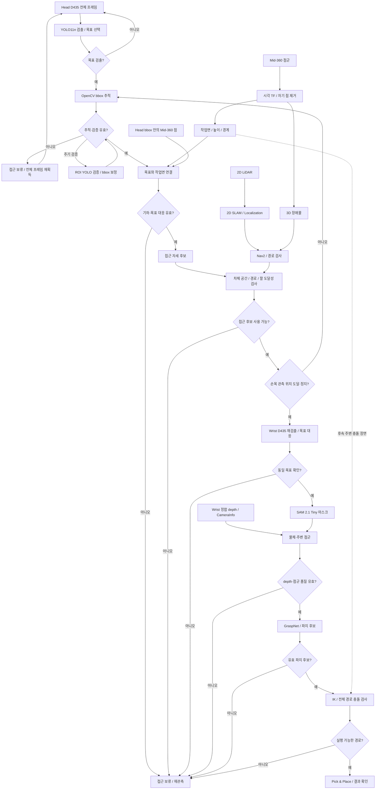

# Detection Workflow

> [!IMPORTANT]
> **설계 갱신: 2026-10-05. Head·Wrist 모두 D435.** 2D LiDAR는 주행·위치 추정, Mid-360은 **3D 장애물 → 작업면 기하 → 접근 자세**, Head D435는 목표 식별·추적, Wrist D435는 분할·depth 점군·파지 입력을 담당한다. [센서 역할·구현 우선순위](SENSOR_ROLES.md)를 먼저 읽으면 전체 흐름을 볼 수 있다.

> **헤드 구현 상태:** 전체 영상 YOLO 탐색 → OpenCV CSRT/KCF 추적 → 주기적 ROI YOLO 재검증의 ROS 2 패키지와 Docker 구성을 작성했다. [코드 구조·실행 가이드](head/README.md)를 참고한다. 학습 가중치는 미포함이며 기본 task는 YOLO11n bbox 검출이다. ROS 빌드·18개 테스트·모델 없는 launch를 확인했고, 실제 모델·센서 통합과 Docker/Jetson 실행은 후속 검증이다.

헤드 카메라는 목표 탐색과 접근 중 추적을 담당한다. YOLO를 매 프레임 실행하는 대신, 최초 검출과 추적 결과의 검증·보정 및 목표 재획득에 사용한다. 손목 카메라는 접근 후 목표를 다시 확인하고 정밀 분할·점군 생성·파지 후보 추정을 담당한다.

> **현재 구성과 과거 설치 기록을 구분한다.** 선택한 카메라는 **Head D435 + Wrist D435**다. [Jetson 기록](../setup/jetson/README.md)의 YOLO/SAM GPU 준비는 과거 확인 결과이며 두 카메라의 실기 통합 완료를 뜻하지 않는다. 기본 헤드 모델은 **YOLO11n (`yolo11n.pt`)**다. 시뮬레이션은 **YDLIDAR G2 / Mid-360S**, 실물도 **YDLIDAR G2 / MID-360**이며 드라이버 출력 topic·frame·스캔 영점을 연결 시 대조한다. 헤드 추적 코드는 존재하며 작업면·접근·손목 분할·GraspNet 통합은 후속 구현이다.

이 문서의 범위는 **목표 검출·추적 → 주변 장애물·작업면 관측 → 접근 자세 생성 → 손목 재관측 → 분할·점군 → 파지 후보 전달**이다. 차체·팔 이동과 Pick & Place 실행은 외부 모듈과의 연결 조건을 설명한다. 관측 거리, 처리 주기와 품질 임계값은 실제 Jetson AGX Orin과 센서에서 측정한 뒤 확정한다.

## 1. 센서와 모델

| 단계 | 센서 / 모델 / 도구 | 역할 |
|---|---|---|
| 헤드 최초 검출·검증·재획득 | 헤드 **D435 RGB**, Ultralytics **YOLO11n** | 클래스, confidence, bbox 생성 및 추적 결과 보정 |
| 헤드 ROI 추적 | **OpenCV 추적기**, 원본 RGB | YOLO 실행 사이에 목표 bbox 갱신, ROI 표시와 상태 판정. 추적기 종류는 실측 비교 후 선택 |
| 주행 위치 추정·장애물 입력 | **2D LiDAR** (YDLIDAR G2, 시뮬레이션·실물 동일) | 2D SLAM·위치 추정·Nav2 기본 입력 |
| 주변 3D 환경 기하 | **Livox MID-360** (시뮬레이션 Mid-360S), `tf2`, **PCL** | 3D 장애물, 작업면·경계·높이, 접근 자세 후보; 이후 주변 충돌 장면 |
| 손목 재검출 | 손목 **D435 RGB**, YOLO11n | 접근 후 달라진 시점에서 같은 목표를 다시 선택 |
| 정밀 분할 | **SAM 2.1 Hiera Tiny**, `SAM2ImagePredictor` | 손목 정지 이미지의 box/point prompt로 목표 마스크 생성 |
| 물체·장면 점군 | 손목 D435 depth, `realsense-ros` / `librealsense`, **Open3D** | RGB-depth 정합, 유효 depth 선택, 역투영·이상점 제거 |
| 파지 후보 | **GraspNet Baseline**, `graspnetAPI` | 6-DoF 파지 위치·방향, 그리퍼 폭, 접근 깊이, 점수 생성 |

초기 모델은 다음 조합으로 평가한다. 성능 수치는 실제 Jetson AGX Orin에서 측정하며, 다른 GPU나 로봇의 FPS를 목표 성능으로 사용하지 않는다.

| 모델 | 체크포인트 / 설정 | 선택 기준 |
|---|---|---|
| YOLO11n | `yolo11n.pt` | 헤드 전체 프레임 검출·주기 검증·재획득과 손목 재검출. bbox를 출력하며 인스턴스 마스크는 출력하지 않음 |
| SAM 2.1 Tiny | `sam2.1_hiera_tiny.pt` + `configs/sam2.1/sam2.1_hiera_t.yaml` | 손목 정지 이미지의 정밀 분할. 추론 시간과 마스크 품질을 함께 평가 |
| GraspNet Baseline | `checkpoint-rs.tar` | RealSense 데이터로 학습한 공식 baseline을 초기 비교 기준으로 사용 |

YOLO 사전학습 모델의 클래스에 없는 대회 물체는 자체 bbox 데이터로 검출 모델을 fine-tuning한다. 기본 헤드 경로에는 YOLO11n-seg와 SAM을 사용하지 않는다. **OpenCV 추적은 클래스 인식을 갱신하지 않으며, SAM 2.1은 클래스 인식이나 depth 복원을 대신하지 않는다.**

## 2. 전체 흐름

### A. 전체 프레임 YOLO11n으로 목표 찾기

1. 탐색 상태에서 헤드 RGB **전체 프레임**에 YOLO11n을 실행해 `class_id`, confidence, bbox를 생성한다. 탐색 중 실행 주기는 연산 예산에 맞춰 정한다.
2. 임무에서 지정한 클래스와 관측 이력을 이용해 목표 인스턴스를 선택한다.
3. bbox를 **원본 RGB 좌표**로 복원하고 촬영 timestamp와 시스템이 부여한 `target_id`를 보존한다. 추론용 resize/letterbox 좌표를 그대로 추적이나 LiDAR 투영에 사용하지 않는다.
4. 선택한 bbox로 OpenCV 추적기를 초기화하고 추적 상태로 전환한다. tracker 내부 ID와 임무의 `target_id`를 구분한다.

같은 클래스의 물체가 여러 개면 클래스 이름만으로 목표를 선택하지 않는다. 접근 전후의 3D 위치와 영상 특징을 함께 사용하고, 구분이 모호하면 재관측한다.

### B. OpenCV ROI 추적과 주기적 YOLO 검증

**ROI를 표시하거나 잘라내는 작업 자체가 검출은 아니다.** YOLO 실행 사이의 프레임에서는 OpenCV 추적기가 선택한 목표의 bbox를 갱신한다. 목표 주변의 여유 영역을 포함한 확장 ROI는 시각화와 검증 검색 범위에 사용한다. LiDAR 대응에 사용하는 목표 bbox와 확장 ROI를 구분한다.

1. 새 헤드 프레임마다 추적기를 갱신하고 bbox 위치·크기, 추적 성공 여부와 이상 징후를 기록한다. 사용할 추적기와 처리 해상도는 이동·가림·크기 변화 조건에서 비교해 결정한다.
2. 검증 주기에 도달하면 YOLO11n을 다시 실행한다. **현재 구현은 확장 ROI 검증**을 사용하고 실패 시 전체 프레임 재획득으로 복귀한다. 더 긴 주기의 전체 프레임 검증은 후속 확장 대상이며 현재 코드에는 포함하지 않는다.
3. YOLO 후보와 추적 bbox를 클래스, 겹침 정도(IoU), 중심 이동량, 크기 변화, 사용 가능한 3D 위치·영상 특징으로 대응시킨다. 가까운 박스나 같은 클래스라는 이유만으로 다른 물체로 전환하지 않는다.
4. 동일 목표가 확인되면 YOLO bbox로 추적기를 보정·재초기화하고 마지막 검증 시각을 갱신한다. 재검출 결과를 받은 시각이 아닌 **검증에 사용한 프레임의 촬영 시각**을 기록한다.
5. 추적기 실패, 검증 불일치 또는 검증 유효기간 초과 시 목표 위치를 무효화하고 외부 접근 모듈에 접근 보류를 알린 뒤, 전체 프레임 YOLO 재획득으로 돌아간다. 동일 인스턴스인지 불명확하면 재획득 성공으로 처리하지 않는다.

검증은 주기뿐 아니라 bbox 위치·크기의 급변, 화면 가장자리 접근, 가림 의심, 영상 bbox와 LiDAR 위치의 불일치에도 요청한다. 구체적인 판단 기준은 실측으로 정한다. 추적기가 성공을 반환해도 배경으로 이동할 수 있으므로 주기 검증을 생략하지 않는다.

비동기 추론을 사용할 경우 YOLO 결과는 해당 입력 프레임의 bbox이다. 오래된 결과를 현재 프레임의 bbox로 덮어쓰지 않는다. 입력 프레임 이후의 추적을 재적용하거나 최신 프레임에서 다시 검증하며, 지연 허용 범위를 넘긴 결과는 폐기한다. 대기열에 모든 프레임을 쌓는 대신 최신 입력을 우선하고, 진행 중인 추론 요청은 중복 발행하지 않는다.

아래는 전체 임무의 논리 단계다. 실제 헤드 노드의 상태·출력은 [구현 가이드](head/README.md)를 따른다. 손목 관측·파지 준비는 아직 헤드 노드에 구현된 상태가 아니다.

| 상태 | 주요 처리 | 전환 조건 |
|---|---|---|
| `SEARCH` | 전체 프레임 YOLO, 목표 선택 | 선택 성공 시 `TRACK`; 미검출이면 탐색 유지 |
| `TRACK` | OpenCV bbox 갱신 | 주기·이상 징후 발생 시 `VERIFY`; 실패 시 `LOST` |
| `VERIFY` | YOLO 재검출과 동일 목표 확인 | 확인 시 `TRACK`; 불일치·기한 초과 시 `LOST` |
| `LOST` | 접근 보류, 기존 3D 위치 무효화, 전체 프레임 재획득 | 동일 목표 확인 후 `TRACK`; 모호하면 재관측·목표 재선택 요청 |
| `WRIST_OBSERVE` | 정지 후 손목 재검출·분할·점군·파지 후보 생성 | 목표·점군 품질 통과 및 유효 후보 확보 시 `GRASP_READY`; 실패 시 재관측 |
| `GRASP_READY` | 파지 후보 전달 | 외부 모듈 검사 후 실행; 장면 변경·관측 만료 시 재관측 |

근접 접근은 `TRACK` / `VERIFY` 중 유효한 3D 위치가 있을 때 병행한다. `VERIFY`에서 마지막 검증이 아직 유효한 동안만 위치를 갱신할 수 있다. 검증 불일치가 확인되면 즉시 접근을 보류한다. 주행 모듈이 손목 관측 위치 도달을 알리고 정지 조건을 통과하면 `WRIST_OBSERVE`로 전환한다.

### C. Mid-360로 환경 기하를 관측하고 접근 자세 생성

Mid-360의 기본 출력은 **주변 장애물과 작업면 기하**다. 헤드 카메라가 목표의 정체성을 찾고, 작업면·경계·주변 장애물로 차체가 설 위치를 정한다. 작은 물체의 직접 LiDAR 검출을 접근의 필수 조건으로 두지 않는다.

1. **3D 장애물:** 관측 시각의 TF와 자기 점 필터를 적용해 Nav2 costmap에 연결한다. 시뮬레이션의 `/mid360/points_filtered` 연결은 이미 설정되어 있다.
2. **작업면:** 중력·바닥 기준의 고정 좌표계에서 ROI·이상점 처리를 거쳐 RANSAC 등으로 평면, 관측 경계, 높이·기울기·잔차를 구한다.
3. **목표 연결:** Head D435의 추적 목표 bbox에 Mid-360 점을 투영해 목표 위치를 구하고, 목표가 놓인 작업면을 선택한다(2026-10-09부터 헤드 depth 대신 사용). bbox 내부 배경 점의 평균을 물체 중심으로 사용하지 않는다.
4. **접근 후보:** 가장자리의 바깥쪽 수평 방향으로 베이스 기준점과 방향을 생성한다. 수평 상판의 수직 법선은 이 방향으로 사용하지 않는다. [기하와 접근 위치 공식](SENSOR_ROLES.md#3-가장자리의-바깥쪽으로-접근-후보-생성)을 따른다.
5. **실행 조건:** costmap의 차체 공간·이동 경로, 팔 도달성, 손목 RGB/depth 공통 시야·관측 거리를 만족하는 후보만 외부 접근 모듈에 전달한다. 생성한 pose 자체는 이동 완료나 파지 가능 판정이 아니다.
6. **연속 갱신:** 헤드 목표 유효성, 작업면·장애물 관측 시각과 접근 후보의 만료를 갱신한다. 목표를 놓치거나 기하·경계가 불충분하면 접근을 보류하고 재관측한다.

Head의 물체 위치는 **bbox 안에서 작업면 1~35 cm 위에 있는 Mid-360 점**(최근 1초 누적, 가장 가까운 군집)으로 구한다. 헤드 aligned depth는 쓰지 않는다. LiDAR는 카메라 쪽 면을 재므로 위치가 물체 중심보다 2~4 cm 카메라 쪽이다(손목 단계에서 보정). 작은 물체에 LiDAR 점이 없다는 이유만으로 충분히 관측된 작업면까지 무효화하지 않는다. 작업면이 있다는 이유로 물체 위치를 임의로 만들지도 않는다.

이동 중 점군 누적은 odometry·점별 시간의 운동 보정이 필요하다. 최근 submap의 생성 시점·누적 구간을 보존하고 같은 점군을 새로운 독립 관측으로 취급하지 않는다. 현재 xyz 자기 점 필터의 출력에는 점별 시간이 보존되지 않으므로 원본 점군으로 별도 처리한다.

접근 완료는 고정 거리로 판정하지 않는다. 실제 D435의 유효 depth 조건과 팔 관측 자세를 만족해 차체·팔이 정지하면 손목 단계로 전환한다. 자세한 상태·입출력·개발 순서는 [센서 역할 문서](SENSOR_ROLES.md)에 있다.

### D. 손목 카메라로 다시 관측

외부 팔 모듈에 목표 3D 위치와 관측 요구사항을 전달한다. 카메라–물체 거리, RGB/depth 공통 시야, 팔 도달성, 손가락·테이블 가림을 만족하는 **관측 자세**를 선택한 뒤 차체와 팔을 정지한다.

- 실제 손목 **D435**의 지원 profile과 최소 관측 거리·RGB/depth 공통 시야를 확인하고 거리별 품질을 실측한다. 거리 예시를 품질 보장값으로 사용하지 않는다. Head와 같은 모델이어도 손목의 장착·거리·노출·depth 조건을 별도로 정한다.
- 손목 RGB에서 YOLO11n을 다시 실행한다. 헤드에서 얻은 픽셀 bbox나 추적기 상태를 손목 이미지에 그대로 재사용하지 않는다.
- 헤드에서 추정한 3D 목표를 손목 영상에 투영해 재검출 후보와 연결한다. 시점 차이와 위치 불확실성을 고려한 ROI를 사용한다.
- 선택한 손목 bbox를 `SAM2ImagePredictor`의 box prompt로 사용한다. 필요하면 물체 내부/배경 point prompt로 마스크를 보정한다.

헤드→손목 전환에는 `target_id`, 클래스, 고정 좌표계의 목표 3D 위치, 위치 품질과 촬영 timestamp를 전달한다. 같은 목표인지 확인한 뒤 **SAM 2.1 Tiny**를 실행하며, 목표 대응이 실패하면 손목 재관측 또는 헤드 재획득을 요청한다.

첫 구현은 정지 이미지의 SAM 분할로 시작한다. 헤드의 고주기 추론을 줄이고 손목 관측과 파지 추론에 연산을 배분한다. 연속 영상 추적이 필요하면 별도의 video predictor 경로를 평가하되, 헤드와 손목 사이의 목표 ID 대응은 별도로 처리한다.

### E. 유효 depth로 점군 생성

손목 RGB, RGB에 정합된 depth, 해당 격자의 `CameraInfo`를 동기화한다. **SAM 마스크가 좋아도 물체의 depth가 없으면 정밀 3D 관측에 성공한 것으로 판단하지 않는다.**

1. 실제 driver의 depth scale·encoding·stride를 확인하고 미터로 변환한다. `16UC1`이라는 이유만으로 고정된 `/1000`을 적용하지 않는다. `32FC1` 입력은 단위 계약을 확인한다.
2. 검증한 거리 범위의 유효 픽셀만 사용한다. 배경으로 튀는 depth와 경계의 혼합 픽셀을 제거한다.
3. 필요하면 disparity-domain spatial filter를 적용한다. Temporal filter는 정지 관측에서만 평가하고, 팔/차체 이동 또는 목표 변경 시 이력을 초기화한다.
4. RGB 마스크와 같은 격자의 intrinsics로 역투영한다. 정합·crop·resize 후의 격자에 맞는 intrinsics를 사용한다.
5. Open3D로 점군을 정리하고, 관측 시점의 TF로 지정된 고정 좌표계에 변환한다.

역투영은 `X = (u−cx)·Z/fx`, `Y = (v−cy)·Z/fy`, `Z = depth_m`이다. 센서 CAD 원점 대신 실제 depth/color optical frame과 보정값을 사용한다.

점군은 두 종류를 유지한다.

| 출력 | 용도 |
|---|---|
| **목표 물체 점군** | SAM 마스크와 유효 depth로 만든 목표 표면. 파지 후보의 목표 물체 대응 확인 |
| **주변 장면 점군** | 테이블·인접 물체를 포함한 작업 영역. 파지 후보의 그리퍼·접근 구간 충돌 검사 |

Hole filling으로 추정한 값은 실제 측정값과 구분한다. 큰 구멍을 메운 결과나 과거 EMA 값만 남은 영역을 관측된 표면처럼 사용하지 않는다. 여러 자세의 점군을 합칠 때는 각 timestamp의 팔 TF와 hand–eye 보정이 필요하다.

### F. GraspNet 파지 후보와 Pick & Place 연결

GraspNet Baseline에 검증된 작업 영역 점군을 입력하고, SAM에서 얻은 목표 점군에 대응하는 후보를 선택한다. 공식 demo의 입력 점 수는 기본 **20,000개**이며 전처리·샘플링을 구현해야 한다. 부족한 점을 반복 샘플링해도 새로운 기하 정보가 생기는 것은 아니다.

- 출력은 단일 잡는 각도가 아니라 **6-DoF pose, 그리퍼 폭, 접근 깊이, score**를 포함한 후보 집합이다.
- `graspnetAPI.GraspGroup`의 NMS·점수 정렬과 baseline의 `ModelFreeCollisionDetector`를 활용한다. 충돌 검사는 목표 점군만이 아니라 주변 장면을 포함한다.
- 실제 Piper의 그리퍼 형상·허용 폭, 카메라 마운트와 접근 방향을 반영한다. Baseline의 기본 손가락 치수와 파지 좌표계가 Piper에 맞는다고 가정하지 않는다.
- 예측 grasp frame을 실제 TCP frame으로 변환한다. 외부 팔 모듈에서 IK와 전체 로봇·경로 충돌 검사를 통과해야 실행할 수 있다.
- 손목 depth의 최소 거리·가림 때문에 **최종 파지 직전에도 depth를 계속 얻을 수 있다고 가정하지 않는다.** 관측 시점의 후보를 고정 좌표계에 저장하고 timestamp·유효기간을 전달한다. 물체 이동이나 장면 변경이 감지되면 재관측한다.

외부 파지 모듈은 후보의 유효기간과 IK·충돌 검사 결과를 확인한 뒤 집기·이동·놓기를 실행한다. 실행 결과와 그리퍼 feedback 또는 재관측 결과로 성공 여부를 확인한다. 후보 생성만으로 Pick & Place 성공을 판정하지 않으며, 놓을 위치와 실행 경로의 계획은 외부 모듈이 담당한다.

## 3. 추적·검증 및 RGB-D 관측 조건: 실측 후 확정

헤드 D435와 손목 D435는 같은 거리·해상도 설정을 공유한다고 가정하지 않는다. 각 장치가 지원하는 RGB/depth profile, 정합 결과와 목표 물체의 관측 품질을 기록한 뒤 운영 조건을 정한다. CAD/시뮬레이션의 카메라 형상은 실제 depth 성능의 근거로 사용하지 않는다.

| 설계 파라미터 | 의미 / 결정 방법 |
|---|---|
| `search_period` | 목표가 없을 때 전체 프레임 YOLO 실행 간격 |
| `verify_period` | 추적 중 YOLO 검증 간격. 목표 유지율과 연산량을 함께 비교 |
| `full_verify_period` | 장기 전체 프레임 검증 간격의 설계안. 현재 헤드 코드는 ROI 검증 실패 시 전체 프레임 재획득으로 복귀하며 이 별도 주기는 미구현 |
| `max_verify_age` | 마지막 성공한 YOLO 검증의 허용 나이. 초과 시 추적 bbox와 접근용 위치를 무효화 |
| `roi_margin` | 목표 bbox 주변의 검증 검색 여유 영역. 화면 경계에서 잘라낸 좌표도 보존 |
| 대응·추적 이상 기준 | confidence, IoU, 중심 이동량, 크기 변화, 3D 위치 불일치 기준 |
| 위치·기하 품질과 유효기간 | 유효 Head depth·위치 분산, 작업면 inlier·잔차·경계 신뢰도, 시간차·관측 나이. LiDAR 물체 군집을 사용할 때만 해당 점 수 조건 추가 |
| 손목 관측 조건 | 실제 거리, 정지 안정성, 유효 depth 비율과 점군 품질 |

실측 운영 조건은 아직 확정하지 않았다. 헤드 코드에는 초기 튜닝값이 있으며 실제 parameter 이름과 설정은 [구현 가이드](head/README.md)와 `config/head_detection.yaml`을 따른다. 위 표는 전체 파이프라인의 설계 항목이다. `max_verify_age`는 정상 검증 주기와 추론 지연을 고려해 정한다. 검증 유효성을 잃으면 접근을 보류하고 재획득한다. 가림 중 추적 유지 등 완화 정책은 실패 사례를 수집한 뒤 별도로 평가한다.

| 실측 항목 | 방법 / 기록 |
|---|---|
| 관측 거리 | 센서별 지원 범위에서 같은 물체를 거리별 촬영하고 **실제 카메라 광학 원점 기준 거리**를 기록 |
| 대상 물체 | 대회 물체 중 무광·광택·어두운 물체와 작은 물체를 포함. 투명 물체는 별도 실패 조건으로 평가 |
| 유효 depth 비율 | 목표 마스크 내부에서 원래 유효하게 측정된 픽셀 비율. Hole filling·과거값 유지로 비율을 부풀리지 않음 |
| 노이즈·편향 | 정지 장면의 반복 측정 흔들림과 알려진 거리/형상에 대한 오차를 **따로** 기록 |
| 점군 품질 | 목표 점 수, 배경 혼입, 표면 구멍, 경계 이상점, 자세별 정합 오차 |
| 추적·복구 | 차체 이동, 가림, bbox 크기 변화, 같은 클래스 물체의 교차에서 추적 유지율·ID 전환·재획득 시간 기록 |
| 검증 정책 | 매 프레임 YOLO와 추적+주기 검증을 같은 영상에서 비교. YOLO 호출 횟수, 검증 지연, 드리프트 발생과 복구 시간 기록 |
| 분할·목표 연결 | 헤드/손목 YOLO bbox 품질, 손목 SAM 마스크 경계, 같은 클래스 물체 간 오인, 헤드→손목 대응 성공률 |
| 전체 지연 | 촬영 timestamp부터 추적 bbox·검증·3D 위치·손목 마스크·점군·파지 후보가 준비될 때까지 단계별 지연과 상위 지연(p95) |
| 동시 처리 부하 | 실제 주행 처리와 센서 수신을 켠 상태의 CPU/GPU·RAM·온도·프레임 누락·주행 주기 지연 |
| 설정 비교 | raw vs spatial/temporal filter, depth preset, 해상도, 노출·IR projector 설정을 동일 장면에서 비교 |

RealSense Viewer와 `rosbag2`로 원본 영상·depth·`CameraInfo`·TF·관절 상태를 저장한다. 추적 bbox, YOLO 검출·검증 결과, 상태 전환과 실패 사유를 함께 기록한다. LiDAR 시험은 원본 점군과 odometry, 선택된 군집을 함께 기록한다. 거리·조명·재질·카메라 설정·필터 상태, Jetson 메모리 용량·전력 모드·모델 실행 형식을 실험 로그에 남긴다.

**관측 거리, confidence, 최소 점 수, 허용 분산, 동기화 오차, 관측 유효기간은 모두 TBD이다.** 실측으로 정한 기준을 통과한 경우에만 다음 단계에 결과를 전달한다. 반복 측정이 안정적이거나 EKF 공분산이 작아도 체계적인 보정 오차가 작다는 뜻은 아니다.

## 4. ROS 2 데이터 계약

현재 저장소의 **ROS 2 Humble**을 기준으로 설계한다. 아래 이름은 제안이며 실제 센서 namespace와 remap한다.

| 제안 인터페이스 | 데이터 | 필수 조건 |
|---|---|---|
| 헤드/손목 RGB 입력 | `sensor_msgs/Image` | 센서 timestamp, optical frame, 영상 크기 |
| 손목 정합 depth 입력 | `sensor_msgs/Image` + `CameraInfo` | RGB 마스크와 동일한 투영 격자, depth 단위·유효값 정의 |
| LiDAR 입력 | `sensor_msgs/PointCloud2` | 실제 frame_id, timestamp. 이동 누적 시 점별 시간/운동 보정 |
| 2D LiDAR 주행 입력 | `sensor_msgs/LaserScan` | 실제 frame_id, timestamp. 외부 주행 모듈에서 사용 |
| `/detection/head/detections` | `vision_msgs/Detection2DArray` | YOLO 실행 프레임의 클래스·bbox·confidence·목표 대응 ID. 추적 결과와 구분 |
| `/detection/head/target_track` | 추적 결과 **메시지 정의 예정** | 원본 RGB 좌표 bbox, 목표 ID, 촬영 timestamp, 추적 상태, 마지막 YOLO confidence·검증 timestamp, 유효 여부 |
| `/detection/head/status` | 상태·실패 사유 **메시지 정의 예정** | `SEARCH` / `TRACK` / `VERIFY` / `LOST` / `WRIST_OBSERVE` / `GRASP_READY`, 상태 timestamp, 접근 보류 여부 |
| `/detection/target_position` | `geometry_msgs/PointStamped` + 품질 메타데이터 | 목표 ID, D435 depth 등 사용한 위치 센서, 좌표계, 품질·관측 나이·최종 YOLO 검증 시각·유효 여부 |
| 작업면 기하 / 접근 후보 | **설계, 미구현**: plane·경계 메타데이터 / `geometry_msgs/PoseStamped` + 메타데이터 | 작업면·목표 ID, frame/stamp, 기하 품질·베이스 기준점·방향·여유·팔 관측 조건·유효기간·보류 사유 |
| 손목 관측 요청 / 응답 | 외부 모듈과 **인터페이스 정의 예정** | 목표 ID·3D 위치·품질·관측 요구사항 전달, 접근 완료·정지 확인·재관측 응답 |
| `/detection/wrist/target_mask` | `sensor_msgs/Image` (`mono8`) | 손목 RGB의 해당 목표 마스크 |
| `/detection/wrist/object_points` / `scene_points` | `sensor_msgs/PointCloud2` | 목표 점군과 장면 점군 분리, frame·관측 ID 일치 |
| `/detection/grasp_candidates` | 파지 후보 배열 **메시지 정의 예정** | 후보 ID, pose, width, approach depth, score, 목표 ID, 관측 timestamp·좌표계 |

기본 헤드 경로에는 `/detection/head/target_mask`가 없다. tracker 점수·성공 여부와 YOLO confidence는 의미가 다르므로 하나의 confidence로 합치지 않는다. 추적 상태에서 클래스와 검출 confidence는 마지막 YOLO 검증값임을 명시한다.

`PoseArray`만으로는 그리퍼 폭과 score를 전달할 수 없으므로 파지 후보 메시지에 함께 담는다. bbox·마스크·점군·후보에는 해당 프레임/점군의 관측 ID를 연결하고, 서로 다른 헤드·손목 관측은 `target_id`로 연결한다. 실패는 `TARGET_NOT_FOUND`, `TRACK_LOST`, `VERIFY_MISMATCH`, `AMBIGUOUS_TARGET`, `INSUFFICIENT_LIDAR_POINTS`, `INVALID_DEPTH`, `STALE_OBSERVATION`, `NO_GRASP_CANDIDATE`처럼 원인을 구분해 반환한다. 무효화 이벤트는 외부 접근 모듈에 전달하며, 오래된 위치를 계속 접근 목표로 사용하지 않는다. 작업면·접근 후보도 `NO_SUPPORT_SURFACE`, `AMBIGUOUS_SUPPORT`, `INVALID_EDGE`, `NO_REACHABLE_APPROACH` 등의 사유로 무효화하며 생성한 pose를 물체 위치와 구분한다.

보정·동기화의 기본 조건은 다음과 같다.

- 헤드 RGB–LiDAR 외부 보정과 손목 **eye-in-hand calibration**을 각각 수행한다. CAD 배치값은 초기값이며 실측 보정값을 대체하지 않는다.
- RGB-depth는 RealSense의 공장 보정 TF와 해당 스트림 `CameraInfo`를 사용한다. 같은 TF를 URDF와 driver가 중복 발행하지 않는다.
- RGB·추적 bbox·depth·마스크와 LiDAR를 관측 시각 기준으로 연결하고 **추론 완료 시각 대신 촬영 시각**으로 TF를 조회한다. 서로 다른 장치의 clock offset도 확인한다. 검증 timestamp와 현재 추적 프레임 timestamp를 구분한다.
- 실측에서 정한 이동 안정성 기준을 통과한 뒤 정밀 관측한다. `message_filters`의 시간 허용 폭은 실측으로 정한다.

## 5. 참고 팀에서 반영한 구조

[Inha-United@home](https://github.com/inha-united-athome)의 공개 코드·설정을 참고했다. 아래 내용은 참고 구조이며 이 저장소에 해당 패키지를 설치·포팅했다는 의미는 아니다.

| 참고 저장소 | 반영할 부분 | 적용 시 확인 |
|---|---|---|
| `inha_perception` | YOLO 검출, box-prompt SAM 2.1 분할, 정합 depth의 점군 변환을 분리 | 실제 코드의 모델·토픽과 README 기본값에 차이가 있음. 경로·namespace를 parameter화하고 인스턴스별 마스크 출력을 추가 |
| `get_seg_3d_coord` | 관측 시각의 TF로 LiDAR/submap 투영 → 후보 점 선택 → PCL 군집화 → 위치 품질 기록 | 참고 구현의 마스크 선택을 기본 헤드의 bbox 선택·배경 제거로 수정해야 함. 군집 거리 `0.30 m`를 작은 파지 물체에 그대로 적용하지 않음 |
| `easy_handeye2` | ArUco 관측과 여러 팔 자세를 이용한 eye-in-hand 보정·검증 | 참고 팀의 frame과 보정값을 복사하지 않고 실제 Piper/손목 카메라에서 다시 측정 |
| `GraspGen_inha` | 필요할 때만 파지 추론을 실행하고, 점군을 기준 좌표계로 변환해 후보를 전달하는 구조 | 이번 기본 모델은 GraspNet. GraspGen은 향후 비교 후보이며 Piper 그리퍼에 대한 적합성 평가가 필요 |

기존 문서에 기록한 참고 팀의 하드웨어 구성은 **헤드 D435f + 팔 D405**이다. 우리 현재 선택은 **Head D435 + Wrist D435**이며 참고 팀의 카메라 구성·보정값을 복사하지 않는다. 두 D435의 장착·내부/외부 보정·관측 품질은 각각 평가한다. `get_seg_3d_coord`와 파지 wrapper의 `inha_interfaces` 의존성도 이 저장소에 포함되어 있지 않다. OpenCV 추적과 YOLO 주기 검증은 현재 헤드 코드에 포함되어 있으며 LiDAR·손목 통합은 후속이다.

## 6. 현재 저장소와 구현 순서

2026-10-03의 최종 `main` 모델에는 Tracer·Piper·센서 랙과 손목 카메라가 기본 포함되어 있다.

| 입력 | 현재 상태 | detection 연결에 필요한 작업 |
|---|---|---|
| 헤드 RGB/depth | Gazebo 센서 존재, 헤드 ROS 브리지 미포함 | Image·CameraInfo 브리지 또는 실제 D435 driver 연결 |
| Mid-360 장애물 입력 | Gazebo→ROS bridge·자기 점 필터·local/global costmap 설정 존재 | 실기 driver·TF 연결, 바닥 기준·가림·팔 자기 점 처리 확인 |
| 작업면·접근 자세 | 설계 단계 | 평면·경계 추출, 목표 대응, 후보 생성·품질·만료·접근 연결 구현 |
| 손목 RGB/depth·점군 | 최종 모델에 손목 카메라 기본 포함, 손목 URDF/광학 프레임과 `/wrist_camera/…` ROS 브리지 설정 존재 | Ubuntu 실구동·메시지 수신 검증, 실제 손목 D435 보정, RGB-depth 정합 |
| 헤드 검출·추적 | ROS 2 패키지·상태 머신·Docker 구성 작성, 학습 가중치 미포함 | 모델 연결, Docker/Jetson·실센서 통합 검증, 실측 튜닝 |
| 3D 위치·손목 분할·파지 후보 | YOLO/SAM GPU 샘플 추론 확인, 통합 파이프라인은 설계 단계 | LiDAR 군집 선택·손목 모델 wrapper·품질 판정·데이터 계약 구현 |

[손목 카메라 가이드](../../HW/URDF/wrist_camera_description/README.md)의 Gazebo 모델은 핀홀 근사이며 실제 depth 노이즈를 재현하지 않는다. `/wrist_camera/depth/image_raw`와 RGB 토픽이 존재한다는 것만으로 정합된 depth라는 뜻은 아니다. 기존 CAD/시뮬레이션의 D435f 표기와 실기 Head D435 / Wrist D435를 구분하고, 성능 판단은 실측 데이터로 수행한다. 헤드 센서의 상세 제약은 [센서 문서](../simulation/docs/SENSORS.md)를 참고한다.

구현은 다음 순서로 진행한다.

1. **센서 입력·보정:** 두 D435의 독립 serial·profile·CameraInfo·hand–eye, LiDAR TF·시각 계약과 자기 점 필터 확인.
2. **Mid-360 3D 장애물 — 1순위:** 기존 Nav2 costmap 입력을 실기와 연결하고 2D 스캔에서 누락되는 높이의 구조물을 관측.
3. **헤드 검출·추적:** 기존 전체 프레임 YOLO11n → OpenCV → ROI YOLO 재검증 코드에 실제 모델·센서 연결.
4. **작업면·접근 자세 — 2순위:** 평면·경계·높이 추출 → Head 목표와 작업면 연결 → 베이스 접근 후보·방향 생성 → 경로·팔 도달성 검사·만료·접근 응답.
5. **손목 D435 정밀 인식:** 정지 후 재검출 → 목표 대응 → SAM 2.1 Tiny → 유효 목표·주변 점군 → 재관측 판정. 거리·설정·품질은 실측.
6. **파지 후보·충돌 장면 — 3순위:** GraspNet의 좌표·그리퍼·주변 충돌 필터, 이후 Mid-360 작업면의 MoveIt planning scene 연결과 외부 IK·경로 검사·Pick & Place 결과 확인.
7. **통합 부하 검증:** 3D 장애물 입력을 유지한 상태로 추적·작업면·손목 추론의 지연·목표 유지율·주행 주기 측정. 동적 장애물 추적·FAST-LIO/3D SLAM은 후순위.

SAM 2는 현재 공식 요구사항이 Python ≥3.10, PyTorch ≥2.5.1이며 GraspNet Baseline은 PyTorch 1.6 기반 요구사항과 custom CUDA 연산자를 제시한다. 단일 Python 환경의 호환성을 가정하지 않고 **모델별 inference 프로세스/컨테이너를 분리**하는 구성을 검토한다. 실제 GPU·CUDA·ROS adapter의 호환성은 별도로 검증하고 사용한 commit과 환경 버전을 기록한다.

외부 접근 모듈은 목표 ID·작업면 기하·검사한 접근 후보와 품질을 받아 차체·팔을 관측 자세로 이동시킨다. 외부 파지 모듈은 후보를 받아 MoveIt 2 등으로 IK·전체 경로를 검사하고 Pick & Place를 실행한다. 주행 알고리즘, 배치 위치 계획, 그리퍼 제어는 이 문서의 구현 범위에 포함하지 않는다.

## 7. Jetson AGX Orin에서의 실행 정책

이 알고리즘은 YOLO 실행 횟수를 줄이고 정밀 추론을 손목 관측 단계에 모으는 설계이다. 성능 향상 폭은 추적 CPU 비용과 재검출 빈도에 따라 달라지므로, 전체 프레임 YOLO 기준선과 실제 통합 부하를 비교한다. 특정 FPS나 전체 실행 가능성을 설치·샘플 추론만으로 보장하지 않는다.

| 운영 단계 | 주요 처리 | 연산 배분 |
|---|---|---|
| 탐색 | 주행 센서·위치 추정·장애물 처리, 헤드 전체 프레임 YOLO | 탐색 YOLO 주기를 제한. 손목 SAM·GraspNet 대기 |
| 추적·근접 접근 | OpenCV 추적, 주기 YOLO 검증, 3D 장애물·작업면 갱신 | 전체 점군의 불필요한 복사·누적을 줄이고 공간 범위·점 수 제한. 손목 정밀 추론 대기 |
| 손목 관측 | 정지 확인, 손목 YOLO → SAM Tiny → RGB-D 점군 | 헤드 추론 빈도를 줄이거나 대기시키고 손목 처리를 순차 실행 |
| 파지 준비·실행 | GraspNet·충돌 필터, 외부 팔 모듈 검사·실행 | 요청 시 추론. 장면 변경이나 실패 시 재관측 |

- 센서 수신률, OpenCV 추적률, YOLO 검증률, 3D 위치 갱신률은 각각 설정한다. 카메라의 모든 프레임에 모든 모델을 실행하지 않는다.
- YOLO TensorRT FP16 등 최적화는 기본 PyTorch 경로의 정확도·입출력 계약과 지연을 확인한 뒤 비교한다. ROI를 작게 잘라도 모델 입력을 같은 크기로 resize하면 추론 비용이 비례해서 감소한다고 가정하지 않는다.
- 모델별 venv/프로세스/컨테이너는 의존성 분리 수단이다. 같은 Jetson의 GPU·메모리·CPU를 공유하므로 SAM과 GraspNet 요청이 무제한으로 겹치지 않게 관리한다.
- 손목 전체 depth 점군을 매 프레임 발행하기보다 필요한 관측에서 목표와 주변 작업 영역의 점군을 만든다. 주변 충돌 정보를 유지하면서 다운샘플링을 평가한다.
- 주행 모듈의 필요한 센서 입력·장애물 처리는 유지한다. `tegrastats`와 ROS timestamp/수신률로 CPU/GPU·RAM·온도·지연을 기록하고, 처리 적체 또는 관측 만료 시 접근을 보류한다.

## 8. 기존 설계 대비 경량화 예상

경량화의 핵심은 **헤드의 segmentation 모델을 detection 모델로 바꾸고, YOLO 실행 사이의 프레임을 OpenCV로 추적하는 것**이다. 추적이 안정적으로 유지되는 예시 조건에서는 헤드 YOLO의 이론적 연산량을 약 **87~96%** 줄일 수 있다. 이 수치는 Jetson 전체 연산량·전력·메모리·실제 지연의 감소율이 아니다.

기존 설계에는 헤드 YOLO 실행 주기가 명시되지 않았으므로 아래 실행률은 **비교용 가정**이다. 두 파이프라인 모두 아직 통합 실측 결과가 없으며, 현재 Jetson에서 해당 실행률을 달성했다는 뜻도 아니다.

### 8.1. 모델 변경에 따른 추론당 연산량 감소

Ultralytics 공식 모델 표의 640 입력 기준 값은 다음과 같다. [공식 YOLO11 모델 표](https://github.com/ultralytics/ultralytics/blob/main/docs/en/models/yolo11.md)

| 모델 | 용도 | 추론당 연산량 |
|---|---|---:|
| 기존 YOLO11n-seg | bbox·클래스·인스턴스 마스크 | 9.8 GFLOPs |
| 수정 YOLO11n | bbox·클래스 | 6.5 GFLOPs |

동일한 실행 횟수에서 모델 연산량은 `1 - 6.5 / 9.8 ≈ 33.7%` 감소한다. 이 계산에는 OpenCV 추적, 영상 전처리, 검출 후처리와 데이터 전달 비용이 포함되지 않는다. FLOPs 감소율을 실제 추론 시간 감소율로 그대로 사용하지 않는다.

### 8.2. 주기적 검증에 따른 YOLO 호출 횟수 감소

아래는 **두 모델 모두 동일한 640 입력을 사용하고, 목표 추적이 안정적인 구간**을 비교한 것이다. 최초 검출·추적 실패에 따른 추가 재획득·이상 징후 검증과 OpenCV 추적 비용은 제외한다. 수정 방식은 YOLO 검증 사이에도 OpenCV bbox 추적을 계속한다.

| 기존 YOLO11n-seg 실행률 | 수정 YOLO11n 검증률 | 기존 초당 YOLO 연산량 | 수정 초당 YOLO 연산량 | YOLO 연산량 감소율 |
|---|---|---:|---:|---:|
| 10회/초 | 2회/초 | 98 GFLOPs | 13 GFLOPs | **86.7%** |
| 30회/초 | 5회/초 | 294 GFLOPs | 32.5 GFLOPs | **88.9%** |
| 30회/초 | 2회/초 | 294 GFLOPs | 13 GFLOPs | **95.6%** |

계산식은 `YOLO 연산량 감소율 = 1 - (수정 실행률 × 6.5) / (기존 실행률 × 9.8)`이다. 예를 들어 기존 모델을 30회/초, 수정 모델을 5회/초 실행하면 `1 - 32.5 / 294 ≈ 88.9%`이다. 실제 구간 비교에서는 수정 실행률에 **정기 검증뿐 아니라 최초 검출·재획득·추가 검증 호출을 모두 포함**한다. 목표를 찾지 못한 탐색 구간과 자주 놓치는 구간은 안정적인 추적 구간보다 절감 폭이 작아질 수 있다.

가장 큰 절감은 ROI 면적보다 **YOLO 호출 횟수 감소**에서 나온다. ROI를 잘라도 같은 모델 입력 크기로 확대하면 추론 비용이 ROI 면적에 비례해서 줄어들지는 않는다.

### 8.3. 전체 파이프라인에서의 효과와 비용

전체 처리에는 LiDAR 수신·군집화, 주행 위치 추정·장애물 처리, RGB/depth 수신·정합, 손목 SAM·GraspNet이 남고 OpenCV 추적 비용이 추가된다. 따라서 헤드 YOLO가 약 90% 가벼워져도 전체 시스템이 약 90% 가벼워진 것으로 표현하지 않는다.

예를 들어 동일한 척도로 산정한 기존 전체 처리 비용 중 헤드 YOLO가 50%이고, 그 부분을 90% 줄인다고 가정하면 나머지 비용이 같을 때 **추적 비용을 더하기 전 전체 절감은 약 45%**이다. 이는 계산 원리를 설명하는 예시이며 실제 Jetson의 부하 비중을 측정한 값은 아니다. CPU와 GPU 사용률을 단순 합산해 이 비중을 계산하지 않는다.

- 기존 설계도 손목 SAM과 GraspNet은 정지 관측 단계에서 실행한다. 수정 방식의 절감률에 이 비용이 제거된 것처럼 포함하지 않는다.
- 호출 빈도 감소만으로 상주 모델의 메모리 사용량이 같은 비율로 줄지는 않는다. 메모리와 전력 변화는 별도로 측정한다.
- 추적 비용과 전체 프레임 재검출 빈도가 증가하면 절감 폭이 작아진다. 가림·카메라 이동·목표 크기 변화·같은 클래스 물체의 교차를 평가에 포함한다.
- 헤드 마스크를 없앤 만큼 bbox 내부 LiDAR 점의 배경·인접 물체 제거가 더 중요하다. 군집 선택 비용과 3D 위치 오류를 함께 비교한다.
- 처리 지연·처리율의 개선은 연산량 절감률과 다르다. CPU/GPU 동시 실행, 메모리 전송과 대기열을 포함한 전체 경로에서 측정한다.

실제 경량화는 같은 녹화 영상과 동일한 입력 크기·실행 형식·전력 모드로 두 파이프라인을 비교해 확인한다. 헤드 YOLO 호출 횟수와 추론 시간, OpenCV CPU 비용, 단계별 평균·p95 지연, CPU/GPU·RAM·온도·프레임 누락뿐 아니라 **목표 유지율·ID 전환·재획득 시간·접근용 3D 위치 품질**을 함께 기록한다. 주행과 센서 수신을 켠 통합 시험에서 목표 인식 품질과 필요한 주행 주기를 유지하는지도 확인한다.

## References

### 모델 · 센서 · 도구의 원본 GitHub

| 기술 | 원본 저장소 |
|---|---|
| YOLO11n / YOLO11-seg 비교 | [ultralytics/ultralytics](https://github.com/ultralytics/ultralytics) |
| SAM 2 / SAM 2.1 | [facebookresearch/sam2](https://github.com/facebookresearch/sam2) |
| GraspNet Baseline | [graspnet/graspnet-baseline](https://github.com/graspnet/graspnet-baseline) |
| GraspNet API | [graspnet/graspnetAPI](https://github.com/graspnet/graspnetAPI) |
| GraspGen — 향후 비교 후보 | [NVlabs/GraspGen](https://github.com/NVlabs/GraspGen) |
| RealSense SDK / Viewer / depth filters | [realsenseai/librealsense](https://github.com/realsenseai/librealsense) |
| RealSense ROS 2 driver | [realsenseai/realsense-ros](https://github.com/realsenseai/realsense-ros) |
| Livox ROS driver 2 / SDK 2 | [Livox-SDK/livox_ros_driver2](https://github.com/Livox-SDK/livox_ros_driver2), [Livox-SDK/Livox-SDK2](https://github.com/Livox-SDK/Livox-SDK2) |
| PCL | [PointCloudLibrary/pcl](https://github.com/PointCloudLibrary/pcl) |
| Open3D | [isl-org/Open3D](https://github.com/isl-org/Open3D) |
| OpenCV — ROI 추적·투영·ArUco·hand–eye calibration | [opencv/opencv](https://github.com/opencv/opencv), [opencv/opencv_contrib](https://github.com/opencv/opencv_contrib) |
| easy_handeye2 원본 | [marcoesposito1988/easy_handeye2](https://github.com/marcoesposito1988/easy_handeye2) |
| ROS 2 TF / 시간 동기화 | [ros2/geometry2](https://github.com/ros2/geometry2), [ros2/message_filters](https://github.com/ros2/message_filters) |
| ROS 메시지 / 기록 도구 | [ros2/common_interfaces](https://github.com/ros2/common_interfaces), [ros-perception/vision_msgs](https://github.com/ros-perception/vision_msgs), [ros2/rosbag2](https://github.com/ros2/rosbag2) |
| Gazebo–ROS 브리지 | [gazebosim/ros_gz](https://github.com/gazebosim/ros_gz) |
| MoveIt 2 — 외부 실행 모듈 | [moveit/moveit2](https://github.com/moveit/moveit2) |

### Inha-United@home 구현 참고

- [조직 및 하드웨어 구성](https://github.com/inha-united-athome)
- [inha_perception](https://github.com/inha-united-athome/inha_perception) — [YOLO 노드](https://github.com/inha-united-athome/inha_perception/blob/main/perception/perception/yolo.py), [SAM 2.1·점군 노드](https://github.com/inha-united-athome/inha_perception/blob/main/perception/perception/groundedsam2.py)
- [get_seg_3d_coord](https://github.com/inha-united-athome/get_seg_3d_coord/tree/v0.5) — [LiDAR 마스크 투영](https://github.com/inha-united-athome/get_seg_3d_coord/blob/v0.5/src/point_selector.cpp), [실측·EKF 기록 흐름](https://github.com/inha-united-athome/get_seg_3d_coord/blob/v0.5/README.md)
- [easy_handeye2 팀 구성](https://github.com/inha-united-athome/easy_handeye2)
- [GraspGen_inha ROS wrapper](https://github.com/inha-united-athome/GraspGen_inha/tree/v0.5/scripts_RBY1)

### 제조사 사양 · 공식 문서

- [D435 사양](https://www.realsenseai.com/products/stereo-depth-camera-d435/), [D435f 사양](https://www.realsenseai.com/products/d435f-3/)
- [D400 권장 depth preset·해상도](https://dev.realsenseai.com/docs/d400-series-visual-presets/), [depth 후처리](https://github.com/realsenseai/librealsense/blob/master/doc/post-processing-filters.md)
- [Mid-360S 사양·근접 검출 제한](https://www.livoxtech.com/mid-360s/specs)
- [YOLO11 지원 모델](https://docs.ultralytics.com/models/yolo11/), [SAM 2 설치 요구사항](https://github.com/facebookresearch/sam2/blob/main/INSTALL.md), [GraspNet RGB-D demo](https://github.com/graspnet/graspnet-baseline/blob/main/demo.py)
