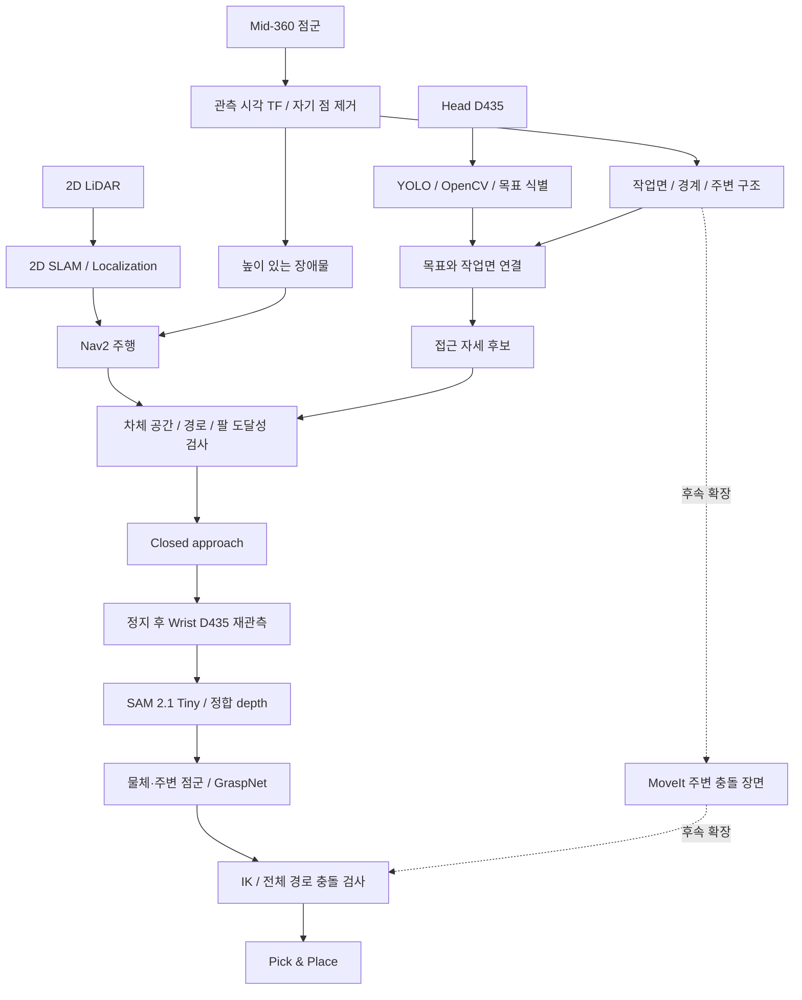

# 센서 역할과 Navigation → Manipulation 연결

**설계 기준: 2026-10-05. Head와 Wrist는 모두 RealSense D435를 사용한다.**

Mid-360은 **주변 3D 환경의 기하를 관측하는 센서**다. 기본 역할은 **3D 장애물 감지 → 작업면 기하 추출 → 근접 접근 자세 생성**이며, 이후 MoveIt의 주변 충돌 장면으로 확장한다.

[전체 인지 흐름](PIPELINE.md) · [헤드 추적 구현](head/README.md) · [Nav2 실행](../simulation/ros2/NAV2.md) · [실기 카메라 명령](../setup/jetson/RUN_COMMANDS.md#2-realsense-head--wrist)

## 센서마다 맡는 일

| 센서 | 기본 역할 | 다음 단계에 전달할 것 |
|---|---|---|
| 2D LiDAR | 2D SLAM·위치 추정, Nav2의 기본 주행 입력 | 지도·로봇 위치·평면 장애물 |
| **Head D435** | YOLO 최초 검출·목표 식별, OpenCV 추적·YOLO 재검증 | 목표 ID·클래스·bbox·촬영 시각, 유효 depth가 있으면 목표 위치 |
| **Mid-360** | 높이가 있는 장애물, 테이블·선반·벽 등의 환경 기하 | 작업면·경계·높이·주변 장애물·접근 자세 후보 |
| **Wrist D435** | 접근 후 목표 재검출, SAM 2.1 Tiny 분할, 정합 depth 관측 | 목표/주변 점군, GraspNet의 파지 후보 입력 |

작은 물체의 위치·파지 표면은 D435로 관측한다. Mid-360의 작업면과 주변 장애물은 차체의 접근 및 팔의 충돌 검사에 사용한다. Head와 Wrist가 같은 모델이어도 serial·내부 보정·외부 장착 보정·관측 거리는 각각 관리한다.

## 전체 연결



그림은 전체 설계다. 현재 코드·설정의 범위는 아래 표에 구분한다.

## 지금 있는 것과 앞으로 만들 것

| 기능 | 현재 저장소의 근거 | 상태 |
|---|---|---|
| 2D SLAM 입력 | [`slam_params.yaml`](../simulation/ros2/slam_params.yaml)의 `scan_topic: /scan` | 시뮬레이션 설정·실행 안내 존재 |
| 3D 장애물 입력 | [`nav2_params.yaml`](../simulation/ros2/nav2_params.yaml)의 local/global costmap | `/mid360/points_filtered`를 PointCloud2 장애물 소스로 설정 |
| Mid-360 ROS 입력 | [`ros_bridge.yaml`](../simulation/ros2/ros_bridge.yaml) | Gazebo `/robocup/mid360s/scan/points` → ROS `/mid360/points` 매핑 존재 |
| 자기 점 제거 | [`cloud_self_filter.py`](../simulation/ros2/cloud_self_filter.py) | footprint 내부 점·고립 점 제거 코드 존재; 팔 전체 형상 필터는 아님 |
| 헤드 검출·추적 | [`HEAD_DETECTION.md`](head/README.md) | ROS 패키지·Docker 구성 존재; 실제 모델·센서 통합은 후속 |
| 작업면 추출 | [`SUPPORT_SURFACES.md`](SUPPORT_SURFACES.md) | `support_surface_node`: Mid-360 → 작업면 높이·윤곽·확인된 가장자리 (Gazebo 확인) |
| 목표와 작업면 연결 | [`CLOSED_APPROACH.md`](CLOSED_APPROACH.md) 1절 | `approach_node`: 목표가 놓인 작업면·확인된 변 선택 (Gazebo 확인) |
| 접근 자세 생성·자동 접근 | [`CLOSED_APPROACH.md`](CLOSED_APPROACH.md) 1절 | `approach_node`: 접근·대기 자세 (Gazebo 확인). 자동 도킹은 미구현 |
| Wrist SAM·GraspNet 통합 | [`README.md`](PIPELINE.md)의 손목 단계 | 통합 노드 미구현 |
| MoveIt 주변 충돌 장면 | 이 문서의 후속 확장 | 연결 미구현 |

`sim.launch.py`는 bridge와 자기 점 필터를 켜지만 SLAM/Nav2는 별도로 실행한다. 위 설정의 존재를 Jetson 실기 주행·접근·파지 검증 완료로 해석하지 않는다.

현재 costmap은 높이 범위와 거리 범위를 제한한다. 특히 local voxel 영역은 `origin_z=-0.15`, `z_resolution=0.1`, `z_voxels=15`이며, Mid-360 marking 범위는 `-0.03 ≤ z ≤ 1.25`다. 이는 현재 Gazebo의 바닥 기준 설정이다. 모든 높이의 장애물을 보장하거나 실기 바닥 기준으로 그대로 옮기는 값이 아니다.

## 구현 1순위 — 3D 장애물 감지

2D LiDAR와 Mid-360을 Nav2의 장애물 입력으로 함께 사용한다. 낮은 스캔 평면에서 누락될 수 있는 상판·돌출부 등을 3D 점군으로 보완한다.

```text
2D LaserScan /scan ────────────────┐
                                  ├→ Nav2 local/global costmap
Mid-360 → 자기 점 제거 → points ───┘
```

- 기존 시뮬레이션 매핑·costmap 설정을 출발점으로 사용한다.
- 실기의 원본 입력은 `/livox/lidar`, 시뮬레이션 입력은 `/mid360/points`다. 실제 TF·시각을 맞추고 필터의 입력을 remap한 뒤 costmap에 연결한다.
- 현재 필터는 footprint 밖으로 뻗은 팔을 제거하지 않는다. 팔 자세에 따라 추가 형상 필터가 필요하다.
- 필터 출력은 `base_link`의 xyz 점군이다. intensity·점별 시간 정보를 보존하는 보정/누적 작업은 원본 점군을 별도로 사용한다.
- 점이 없다는 이유로 빈 공간이라고 단정하지 않는다. 장애물 marking과 clearing은 각각의 관측 범위를 확인한다.

## 구현 2순위 — 작업면과 접근 자세

### 1. 작업면 기하 추출

관측 시각의 TF로 점군을 `odom` 또는 `map` 같은 고정 좌표계로 변환한다. 중력 방향·바닥 기준을 정의하고, ROI·이상점 처리를 거쳐 RANSAC 등으로 지지 평면을 추출한다.

평면 `ax + by + cz + d = 0`의 단위 법선은 `n = (a,b,c) / sqrt(a²+b²+c²)`다. 법선 방향을 일관되게 정한 뒤 평면 높이·기울기·관측 경계·inlier 수·잔차를 보관한다. 평면 하나를 찾았다는 이유만으로 목표의 작업면이나 전체 가구 경계를 확정하지 않는다.

### 2. Head의 목표와 작업면 연결

Head D435의 목표 ID·bbox·유효 depth와 Head–LiDAR 보정값을 이용해 목표가 놓인 작업면 후보를 선택한다. bbox 안의 모든 LiDAR 점을 물체 중심으로 평균내지 않는다. 작은 컵·손잡이 등에 LiDAR 점이 없더라도 충분히 관측된 작업면을 접근 기하로 사용할 수 있다.

목표 대응이 모호하거나 작업면 경계가 가려졌으면 유효한 접근 목표를 발행하지 않고 재관측한다. 헤드 추적기의 목표 ID는 작업면 ID와 별도로 유지한다.

### 3. 가장자리의 바깥쪽으로 접근 후보 생성

수평 상판의 평면 법선은 거의 수직이므로 그 수평 성분을 접근 방향으로 사용할 수 없다. **접근할 가장자리의 접선에서 수평 수직 방향을 구하고, 작업면 바깥쪽·관측된 로봇 쪽 빈 공간을 향하도록 부호를 선택**한다. 유효한 경계가 없으면 방향을 임의로 만들지 않는다.

- `p_edge_xy`: 사용할 가장자리의 XY 위치
- `n_out_xy`: 작업면 바깥쪽을 향하는 수평 단위 벡터
- `d_base`: 가장자리와 로봇 **베이스 기준점** 사이의 거리

```text
p_goal_xy = p_edge_xy + d_base * n_out_xy
yaw_goal = atan2(-n_out_y, -n_out_x)
```

베이스는 작업면 바깥에 서고 방향은 작업면을 바라본다. `d_base`는 footprint·차체 여유·팔 도달성·Wrist D435의 관측 조건을 함께 고려해 정한다. 이 값은 카메라–물체 거리와 다르며 고정 숫자로 확정하지 않는다.

여러 후보에 대해 Nav2 costmap·차체 경로·팔 관측 자세·RGB/depth 공통 시야를 확인한다. 접근 후보를 생성하는 단계와 Nav2에 실제 goal을 보내는 단계를 분리한다. 도달 후 차체와 팔을 멈추고 Wrist 관측으로 전환한다.

### 전달할 데이터 — 인터페이스 제안

다음 항목은 아직 구현하지 않은 출력 계약이다. 단순 Pose만 보내고 관측 품질·유효기간을 버리지 않는다.

| 출력 | 필요한 정보 |
|---|---|
| 작업면 | plane·관측 경계·높이·기울기·잔차·inlier 수, frame/stamp, 작업면 ID |
| 목표 연결 | target ID·작업면 ID·연결 근거·품질·마지막 YOLO 검증 시각 |
| 접근 후보 | `geometry_msgs/PoseStamped` + 메타데이터: 베이스 기준점, 거리·여유, 팔 관측 조건, 유효 여부·만료·실패 사유 |
| 접근 결과 | 도달·정지 여부, 실패/재관측 요청, 사용한 목표·관측 ID |

추적 실패, 오래된 관측, 불충분한 작업면·경계, 도달 불가인 경우 후보를 무효화한다. 보류 사유는 `TRACK_LOST`, `STALE_OBSERVATION`, `NO_SUPPORT_SURFACE`, `AMBIGUOUS_SUPPORT`, `INVALID_EDGE`, `NO_REACHABLE_APPROACH` 등으로 구분한다.

## 구현 3순위 — 주변 충돌 장면

Mid-360에서 얻은 테이블·선반·벽 등의 거친 기하를 `moveit_msgs/PlanningScene`의 주변 장애물로 연결하는 단계를 추가한다. 관측 stamp·물체 ID·갱신/삭제 규칙을 정하고 오래된 장면을 계속 사용하지 않는다.

Wrist D435의 목표·주변 점군은 물체 주변의 세부 충돌과 파지 후보에 사용한다. Mid-360의 거친 장면과 함께 전체 팔·그리퍼·카메라 마운트·접근/퇴각 경로를 검사한다. 작업면 점 몇 개나 footprint만으로 팔 충돌 검사를 대체하지 않는다.

## 이번 기본 설계에서 후순위인 것

| 기능 | 결정 |
|---|---|
| Mid-360 FAST-LIO / 3D SLAM | 기본 위치 추정은 2D LiDAR. 별도 요구가 생긴 뒤 검토 |
| 동적 장애물 추적 | 3D 장애물 입력과 정적 작업면 단계 이후 |
| Mid-360로 작은 물체 직접 검출·GraspNet 입력 | 기본 경로는 D435의 RGB·depth 사용 |

## 근거

- 사용자 제공 센서 역할 제안, 2026-10-05; 카메라 선택은 **Head/Wrist 모두 D435**로 갱신.
- 저장소의 [Nav2 설정](../simulation/ros2/nav2_params.yaml), [SLAM 설정](../simulation/ros2/slam_params.yaml), [자기 점 필터](../simulation/ros2/cloud_self_filter.py).
- [RealSense ROS wrapper 4.58.4 launch 인자](https://github.com/realsenseai/realsense-ros/blob/4.58.4/realsense2_camera/launch/rs_launch.py): D435 color는 `rgb_camera.color_profile`, depth는 `depth_module.depth_profile` 사용.
