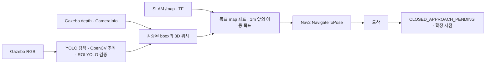

# Gazebo 검출 → SLAM 지도 → Nav2 이동 테스트

이번 테스트 범위는 **헤드 검출 → 목표의 map 좌표 추정 → 목표 앞의 고정 지점으로 Nav2 이동**이다.
SLAM Toolbox는 지도와 map→odom TF를 만들고 Nav2가 경로 계획·장애물 회피·주행을 수행한다.
검출 연결 노드는 `/cmd_vel`을 직접 발행하지 않는다. closed approach와 손목 파지는 아직 실행하지 않는다.



## 준비된 파일

- `scripts/prepare_sim_demo.py`: 공식 사전학습 YOLO11n과 Ultralytics bus 표본 이미지 다운로드.
- `scripts/test_video.py`: 실제 head pipeline으로 이미지·영상·웹캠 테스트, 박스·ROI가 표시된 MP4 저장.
- `config/sim_detection.yaml`: 사전학습 `bus` 클래스, Gazebo RGB 입력.
- `launch/sim_detection.launch.py`: detector + detection→Nav2 goal 노드. SLAM/Nav2는 기존 launch 사용.
- `nav_goal_node.py`: 검증된 RGB/depth를 촬영 시각 TF로 map에 변환, 3회 위치 안정성 확인,
  알려진 free 공간에 고정 목표를 생성하고 `NavigateToPose`에 한 번 전달.
- `closed_approach.py`: **도착 후 정밀 접근이 들어갈 자리**. 현재는 요청 정보를 보존하고
  `CLOSED_APPROACH_PENDING`만 반환한다. 이후 새 센서 관측·closed approach·손목 관측을 연결한다.

## 1. 모델 없이 작성한 코드에서 사전학습 모델로 테스트

저장소 루트에서:

```bash
cd /home/projectsh/Documents/INHA/RoboCup/INHA-RoboCup-Home-2th-2027
python3 SW/detection/head/scripts/prepare_sim_demo.py

# 이 개발 PC에는 아래 테스트 환경과 사전학습 파일을 이미 준비했다.
SW/detection/head/.venv-test/bin/python3 SW/detection/head/scripts/test_video.py \
  --model SW/detection/head/models/yolo11n.pt \
  --source SW/detection/head/demo_assets/bus.jpg \
  --frames 100 --output SW/detection/head/demo_assets/detection_test.mp4
```

이미지는 같은 프레임을 반복해 검출→추적→주기 검증을 시험한다. 움직임·가림·재획득은
`--source /absolute/path/video.mp4` 또는 웹캠 번호 `--source 0`으로 별도 시험한다.
초록 박스는 목표 bbox, 파란 박스는 확장 검증 ROI다. `YOLO=True`는 해당 프레임의 재검출이다.

다른 PC에서 CPU 테스트 환경을 만들려면 Ubuntu 22.04 / Python 3.10 기준:

```bash
sudo apt-get install -y python3-venv
python3 -m venv --system-site-packages SW/detection/head/.venv-test
SW/detection/head/.venv-test/bin/python3 -m pip install \
  --index-url https://download.pytorch.org/whl/cpu torch==2.5.1 torchvision==0.20.1
SW/detection/head/.venv-test/bin/python3 -m pip install --ignore-installed numpy==1.26.4
SW/detection/head/.venv-test/bin/python3 -m pip install -r SW/detection/head/docker/requirements.txt
SW/detection/head/.venv-test/bin/python3 -m pip uninstall -y opencv-python opencv-python-headless
SW/detection/head/.venv-test/bin/python3 -m pip install --no-deps opencv-contrib-python-headless==4.10.0.84
```

## 2. ROS/Gazebo 통합 실행 준비

Gazebo Harmonic과 ROS 2 Humble은 기존 `SW/setup/install_ros2_gz.sh` 설치 구성을 따른다.
이 개발 PC에는 ROS/Gazebo 자체는 있지만 **ROS Gazebo bridge·SLAM Toolbox·Nav2는 아직 없다**.
해당 PC에서 통합 실행하려면 다음 패키지를 먼저 설치해야 한다.

```bash
sudo apt-get install -y ros-humble-ros-gzharmonic ros-humble-navigation2 \
  ros-humble-nav2-bringup ros-humble-slam-toolbox ros-humble-teleop-twist-keyboard \
  ros-humble-tf2-geometry-msgs
source /opt/ros/humble/setup.bash
cd SW/detection/head/head_detection_ws
colcon build --packages-select robocup_detection_msgs robocup_head_detection --symlink-install
cd ../../../..
source SW/detection/head/head_detection_ws/install/setup.bash
```

### 각 터미널 공통 환경

모든 터미널에서 저장소 루트로 이동하고 아래 환경을 적용한다.

```bash
cd /home/projectsh/Documents/INHA/RoboCup/INHA-RoboCup-Home-2th-2027
source /opt/ros/humble/setup.bash
source SW/detection/head/head_detection_ws/install/setup.bash
export ROS_LOCALHOST_ONLY=1
export ROS_DOMAIN_ID=0
```

### 터미널 1: Gazebo 방 + 검출용 표적

```bash
ros2 launch SW/simulation/ros2/sim.launch.py world:=room rviz:=false \
  detection_demo:=true target_image:=$PWD/SW/detection/head/demo_assets/bus.jpg
```

로봇 앞 `(2.2, 0.25, 1.3)`에 표본 이미지를 붙인 정적 판을 생성한다. **실제 3D 버스가 아니라
이미지 판**이며, 이번 목적은 검출 좌표→지도 목표→주행 연결 확인이다. 실제 물체 인식·depth 품질과
파지 가능성은 검증하지 않는다. 테스트 모드에서만 헤드 RGB/depth를 640×480, 10Hz로 줄이고 depth
상한을 5m로 늘린다. 원본 URDF는 수정하지 않는다. RGB/depth의 다른 시야각은 각각 CameraInfo로
계산하며 같은 광학 원점을 가진 현재 Gazebo 센서에만 적용한다.

### 터미널 2: SLAM

```bash
ros2 launch slam_toolbox online_async_launch.py \
  slam_params_file:=$PWD/simulation/ros2/slam_params.yaml use_sim_time:=true
```

### 터미널 3: Nav2

```bash
ros2 launch nav2_bringup navigation_launch.py \
  params_file:=$PWD/simulation/ros2/nav2_params.yaml use_sim_time:=true
```

`Managed nodes are active`와 `/navigate_to_pose` action 준비를 확인한다.
필요하면 기존 [SLAM 가이드](../../simulation/ros2/SLAM.md)대로 키보드로 주변을 관측해 지도를 만든다.
목표와 로봇 footprint가 unknown 셀에 있으면 검출 노드가 이동 목표를 보내지 않는다.

### 터미널 4: 검출 + map 목표 + 이동

```bash
ros2 launch robocup_head_detection sim_detection.launch.py \
  model_path:=$PWD/detection/models/yolo11n.pt device:=cpu \
  python_executable:=$PWD/SW/detection/head/.venv-test/bin/python3 \
  auto_send:=true standoff_distance:=1.0
```

`auto_send:=false`면 목표를 `/detection/navigation_goal`에 표시하고 이동은 요청하지 않는다.
프로세스당 고정 목표 한 개만 선택한다. 새 표적을 시험하려면 이 터미널을 재시작한다.
목표가 확정된 뒤에는 매 프레임 목표를 바꾸지 않는다. 이 단계는 closed approach가 아니다.

### 터미널 5: 확인

```bash
ros2 topic echo /detection/navigation_status
# 다른 터미널에서 확인할 수 있는 토픽:
ros2 topic echo /detection/head/target
ros2 topic echo /detection/navigation_goal
```

RViz는 [Nav2 가이드](../../simulation/ros2/NAV2.md)대로 열고 Fixed Frame을 `map`으로 설정한다.
`/detection/navigation_goal` Pose와 `/detection/target_map_point` PointStamped,
`/detection/head/debug_image` Image를 추가하면 목표와 bbox/ROI를 확인할 수 있다.
정상 진행: `CONFIRMING_MAP_POSITION → GOAL_SENT → NAVIGATING → ARRIVED → CLOSED_APPROACH_PENDING`.

## 3. closed approach 연결 지점

`DetectionNavGoalNode.closed_approach_handoff()`에서 `ClosedApproachRequest`를 만든다.
요청에는 `target_id`, 촬영 시각을 가진 `target_map_point`, Nav2 이동 목표를 포함한다.
연결용 `/detection/closed_approach/target`와 `/detection/closed_approach/target_id`도 발행한다.
현재는 자리만 남겨두었다. 미래 closed approach는 저장된 위치를 정밀 측정처럼 사용하지 말고
도착 후 새 RGB/depth·TF 관측으로 검증한 뒤 진행해야 한다.

Nav2 거절·실패 시에는 이 handoff를 호출하지 않는다. 이 테스트는 손목 카메라·팔·그리퍼를 움직이지 않는다.
중단할 때에는 검출 터미널뿐 아니라 Nav2/Gazebo 터미널도 종료해 진행 중인 주행을 끝낸다.

## 4. 테이블 위 물체 검출 (GPU)

방 world의 두 테이블 위 물체(접시·컵·바나나·환타 캔·복숭아·사과·청사과)를 헤드 카메라로 검출해 map 좌표를 구한다.
물체는 `sim/table-scene` 브랜치의 world가 필요하다. 표적 이미지 판(`target_image`)과 `detection_demo`는 쓰지 않는다.
테이블 물체는 2~3 m에서 30~90 px로 작아 640×480·YOLO11n으로는 거의 검출되지 않으므로, 1920×1080 원본 해상도와
**YOLO11m · 입력 1280 · GPU**를 사용한다.

### 준비 (최초 1회)

```bash
# CUDA torch로 교체 (CPU 환경을 만든 뒤). MX450에서 확인: torch 2.5.1+cu124
SW/detection/head/.venv-test/bin/python3 -m pip install --index-url https://download.pytorch.org/whl/cu124 \
  --force-reinstall torch==2.5.1 torchvision==0.20.1
SW/detection/head/.venv-test/bin/python3 -m pip install --ignore-installed numpy==1.26.4
curl -L -o SW/detection/head/models/yolo11m.pt \
  https://github.com/ultralytics/assets/releases/download/v8.3.0/yolo11m.pt
```

GPU 메모리가 2 GB이면 Gazebo 화면과 RViz를 내장 GPU에서 띄워 VRAM을 확보한다. 센서 렌더링(서버)만 NVIDIA를 쓴다.

```bash
# 터미널 1: Gazebo 서버만 (NVIDIA)
__NV_PRIME_RENDER_OFFLOAD=1 __GLX_VENDOR_LIBRARY_NAME=nvidia \
  ros2 launch SW/simulation/ros2/sim.launch.py world:=room rviz:=false gui:=false
# 터미널 1-2: Gazebo 화면 (내장 GPU)
GZ_PARTITION=robocup_motion GZ_IP=127.0.0.1 gz sim -g
```

SLAM·Nav2는 2절과 같다. 로봇을 0.5 m 정도 움직여 지도를 채운 뒤, 테이블이 모두 보이는 (-0.5, 0.4)·정면 방향에서 실행한다.

### 터미널 4: 테이블 물체 검출

```bash
ros2 launch robocup_head_detection sim_detection.launch.py \
  config:=$PWD/detection/head_detection_ws/install/robocup_head_detection/share/robocup_head_detection/config/sim_table_detection.yaml \
  model_path:=$PWD/detection/models/yolo11m.pt device:=0 \
  python_executable:=$PWD/SW/detection/head/.venv-test/bin/python3 auto_send:=false
```

[`sim_table_detection.yaml`](head_detection_ws/src/robocup_head_detection/config/sim_table_detection.yaml)의 기본 목표는 `cup`이다.

| 사전학습 COCO 결과 (YOLO11m, 1280) | 클래스·신뢰도 |
|---|---|
| 머그컵 | `cup` 0.8 — 가장 안정적 |
| 사과·청사과 | `apple` 0.5~0.6 |
| 바나나 | `frisbee`로 오검출 |
| 접시 | 검출 안 됨 |

| 설정 | 값 | 이유 |
|---|---|---|
| `imgsz` | 1280 | 640에서는 테이블 물체가 거의 검출되지 않음 |
| `roi_margin` | 6.0 | ROI = 박스×margin. 2.0이면 144×120 px ROI를 1280으로 9배 키워 재검증이 실패하고 추적이 계속 초기화됨 |
| `input_timeout` | 3.0 | 실시간 기준 감시. Gazebo가 실시간보다 느려 프레임이 1초 넘게 끊기면 추적이 초기화됨 |

확인 결과(컵, 2.4 m): YOLO 검증 프레임 34개의 map 위치가 실제 모델 원점과 수평 5.3 cm 차이였다. 대부분 카메라 쪽
컵 표면(반지름 약 4.5 cm)을 측정하기 때문이다. GPU 추론은 약 0.17 s/frame(CPU 1.2~3.4 s)이다.

**알려진 제한**
- 기존 노드는 목표 1 m 앞을 이동 목표로 잡으므로 테이블 다리 옆에 떨어져 `GOAL_OCCUPIED_OR_UNKNOWN`이 된다. 테이블 가장자리 기준 접근 자세는 후속 작업이다.
- TF에 바닥 기준 `base_footprint`가 없어 `base_link`(바닥 위 0.1425 m)가 map z=0에 놓인다. 따라서 map의 높이는 실제보다 0.1425 m 낮다(컵 0.62 m → 실제 0.76 m). 수평 위치에는 영향이 없다.

## 실패 사유

| 상태 | 확인할 것 |
|---|---|
| WAITING_SLAM_MAP | SLAM 노드, `/map`, map frame |
| WAITING_VERIFIED_RGB_DEPTH | 헤드 ROS 브리지, 검출 클래스 bus, 학습/사전학습 모델 경로 |
| WAITING_MAP_TF | map→odom→base_link→camera_optical_frame, 촬영 시각 TF |
| WAITING_SYNCHRONIZED_DEPTH | RGB/depth timestamp, 동일 광학 frame |
| INVALID_TARGET_DEPTH | 32FC1 m 단위, bbox 중앙 유효 depth, 배경 혼입 |
| GOAL_OCCUPIED_OR_UNKNOWN | 주변을 먼저 매핑, 목표 주변 여유 공간 |
| WAITING_NAV2_ACTION_SERVER | Nav2 lifecycle 준비, `/navigate_to_pose` |
| STALE_OBSERVATION | CPU 추론 지연·시뮬레이터 부하, 필요 시 호환 GPU 사용 |

## 검증 범위

로컬에서 ROS 패키지 빌드와 **23개 테스트**를 통과했고, 실제 사전학습 YOLO11n으로 표본 이미지의
검출·OpenCV 추적·주기 재검증을 확인했다. 통합 Gazebo→ROS→SLAM→Nav2 이동은 필요한 패키지가 없어
아직 실행 확인하지 않았다. 설치와 샘플 추론 성공만으로 자동 주행 성공을 보장하지 않는다.
추가로 이 PC의 단독 Gazebo 센서 렌더링 시험은 EGL/GLX 초기화 오류로 영상을 받지 못했다.
기존 Gazebo 그래픽 설정을 먼저 확인해야 하며, 테스트 표적의 실제 렌더링도 아직 미검증이다.

Docker에서 detector만 실행하려면 `USE_SIM_TIME=true`, `ROBOCUP_MODEL=/models/yolo11n.pt`,
`ROBOCUP_CONFIG=sim_detection.yaml`, `ROS_LOCALHOST_ONLY=1`을 사용한다. 호스트의 Nav2 연결 launch는
`start_detection:=false`로 실행해 detector를 중복 기동하지 않는다. host/컨테이너의 ROS_DOMAIN_ID와
ROS_LOCALHOST_ONLY를 맞춰야 한다.

공식 참고: [Gazebo ROS 브리지](https://gazebosim.org/docs/harmonic/ros2_integration/),
[YOLO11](https://docs.ultralytics.com/models/yolo11/).
