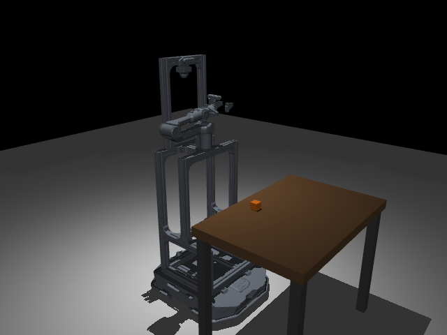

# MuJoCo Manipulation · 손목 관측에서 픽앤플레이스까지

> **Ubuntu 개발 PC용 독립 시뮬레이션 튜토리얼입니다.** 4cm 큐브의 탑다운 손목 관측 → GraspNet 1회 추론 → RViz 상위 50개 후보 확인 → MoveIt 계획 → MuJoCo 접촉 파지·배치를 재현합니다. 실제 로봇 구동과 Nav2·헤드 검출 연결은 별도 작업입니다.

로봇은 [공용 조립 URDF](../robot_description/robocup.urdf)를 사용하며, 메시와 CAD는 [HW/URDF](../../../HW/URDF/README.md)를 참조합니다. 저장소 전체를 clone해야 합니다. Gazebo와 MuJoCo는 별도 실행 경로이므로 튜토리얼 실행 중 Gazebo/다른 ROS 관절 게시 노드는 종료합니다.

> [!IMPORTANT]
> **검증 기준: 2026-10-06.** 새 프로파일·팔 장착 위치와 joint1 영점을 반영한 **nominal robocup.urdf**에서 PICK_AND_PLACE_PASS / DONE을 확인했습니다. 시작과 최종 복귀는 모두 `[0,0,0,0,0,0]` rad입니다. 실물용 보정 모델은 별도이며 이 결과를 calibrated URDF의 검증으로 해석하지 않습니다.

## 먼저 확인할 문서

| 알고 싶은 것 | 문서·파일 |
| --- | --- |
| 새 PC 설치·터미널별 실행·Colab | [상세 튜토리얼](docs/TUTORIAL.md) |
| 입력·후보의 좌표계와 재사용 조건 | [데이터 안내](data/README.md) |
| GPU 추론 원본 | [Colab 노트북](colab/graspnet_wrist_camera.ipynb) / [사용법](colab/README.md) |
| 이번 하드웨어 변경과 실제 검증 수치 | [검증 보고서](docs/VALIDATION.md) |
| 이번 성공 실행 원본 | [성공 JSON](reports/updated_urdf_pick_place.json) |
| 모델·추론 출처와 checksum | [provenance](docs/provenance.json) |

## 구현 범위와 현재 상태

| 항목 | 상태·의미 |
| --- | --- |
| 새 URDF 물리 파지·배치·초기 복귀 | **PICK_AND_PLACE_PASS / RETURN_TO_INITIAL / DONE** |
| 선택 후보 | 741 · score 1.62249 · 예측 폭 82.602mm |
| 실제 최대 개구 정책 | 약 70mm · 큐브 전체와 양쪽 1mm 여유 검사 |
| 양손가락 접촉·실제 상승 | link7/link8 접촉 · 약 19.967cm |
| 들기 중 최대 상대 위치·회전 변화 | 0.267mm / 0.01183rad |
| 옆 배치 | 왼쪽 불가 시 오른쪽 10cm · 이번 오차 약 0.75mm |
| 초기 자세 복귀 | 최대 관절 오차 0.00499rad · 기준 0.02rad |
| 관측·MoveIt FK | 실제 관측 도달 / 20개 자세의 서비스 FK 일치 확인 |
| 실제 주행·Detection·센서 보정 | 중심 좌표·정지 접근을 가정 · 실기 연동 미검증 |



그림은 사전 모델 검증 렌더이며 성공 실행의 영상 캡처는 아닙니다. 성공 수치는 위 JSON의 실제 관절·물체·접촉 피드백입니다. 물체를 손에 weld하거나 위치를 강제하지 않습니다. 고정 마운트 모델은 실물 처짐이나 탄성을 검증하지 않습니다.

## 파일 구조

```text
SW/simulation/mujoco/
├── README.md
├── requirements_success.txt       # 로컬 CPU Python 의존성
├── run_mujoco_moveit_bridge.py     # ROS 궤적·그리퍼 명령과 실제 물리 실행
├── run_wrist_observation.py        # 관측 자세 계획·이동
├── run_grasp_moveit.py             # 후보 검사·파지·lift·place 상태 머신
├── manipulation/                  # 공용 모델 변환·좌표계·접촉/형상 검사
├── launch/                        # MoveIt / robot_state_publisher
├── config/                        # 성공 장면·RViz·안전 판정 설정
├── scripts/                       # 점군 생성·결과 import·RViz 게시
├── colab/                         # 성공한 GPU 추론 원본
├── data/                          # 4cm 큐브 점군·원본 후보
├── docs/                          # 상세 방법론·출처
├── tests/                         # CPU 회귀 검사
├── tools/                         # 로컬 환경 확인
├── reports/                       # 보존 성공 로그, 실행 결과는 로컬 생성
└── SW/simulation/generated/          # 실행 시 생성, Git에서 제외
```

`mid360_cloud.py`, `generate_mid360_cloud.py`는 손목 경로가 재사용하는 해시·변환·ROS snapshot helper를 포함합니다. 현재 안내 경로의 입력 센서는 손목카메라이며 LiDAR 추론 경로를 실행하는 것이 아닙니다.

## 시스템 흐름

```mermaid
flowchart LR
    A[상위 인식에서 물체 중심 수신 가정] --> B[중심 앞 40cm 정지 장면]
    B --> C[손목카메라 탑다운 관측 자세로 이동]
    C --> D[보이는 표면의 3D 점군 1회 생성]
    D --> E[Colab GraspNet 1회 추론]
    E --> F[RViz 원본 상위 50개 확인]
    F --> G[실제 개구 적합성 · IK · 충돌 · 배치 검사]
    G --> H[접근 · 닫기 · 양손가락 접촉 확인]
    H --> I[20cm lift · 상대 자세 안정성 확인]
    I --> J[좌우 10cm 배치 · 열기 · 시작 자세 복귀]
```



GraspNet은 2D 픽셀 좌표가 아닌 **카메라에서 보이는 표면의 3D XYZ 점군**을 받습니다. 카메라 프레임, 물체 프레임, 그리퍼 TCP는 서로 다르므로 metadata의 강체 변환과 `target_tcp()`의 depth 오프셋을 적용합니다. 관측 자세가 접근 시작 자세이며 기존 20cm 참고 pre-grasp를 별도 경유하지 않습니다.

## ROS 인터페이스

| 이름 | 형식 | 방향·의미 |
| --- | --- | --- |
| `/arm_controller/follow_joint_trajectory` | `control_msgs/action/FollowJointTrajectory` | MoveIt → 브리지, 팔 6관절 궤적 |
| `/joint_states` | `sensor_msgs/msg/JointState` | 브리지 → MoveIt, 실제 관절 상태 |
| `/simulation/grasp_status` | `std_msgs/msg/String` 안의 JSON | 단계·시뮬레이션 시간·world 변환·접촉력·개구·실패 |
| `/gripper_command` | `std_msgs/msg/Float64` | 닫기/열기 목표; **joint7 변위(0~0.035m)**, 전체 폭과 구분 |
| `/base_state` | `std_msgs/msg/String` | `MOVING` / `STOPPED`, 접힌 자세 인터록 |
| `/manipulation_stage` | `std_msgs/msg/String` | 실행 단계 전달 |
| `/grasp_targets` | `geometry_msgs/msg/PoseArray` | MuJoCo 목표 마커 |

손가락 joint8은 joint7의 반대 방향입니다. 전체 개구는 메시의 실제 안쪽 표면으로 측정하며 명령값을 전체 폭으로 해석하지 않습니다.

## 개발환경과 실행 순서

검증된 로컬 환경은 Ubuntu 22.04.5 / Python 3.10.12 / ROS 2 Humble / MoveIt 2.5.10 / MuJoCo 3.3.7입니다. 로컬 NVIDIA GPU는 필요 없습니다. ROS 저장소 등록부터 설명한 [환경 구축](docs/TUTORIAL.md#2-새-pc-준비)을 먼저 완료합니다.

저장소 루트에서:

```bash
cd SW/simulation/mujoco
source /opt/ros/humble/setup.bash
/usr/bin/python3 -m venv --system-site-packages .ros_venv
source .ros_venv/bin/activate
python -m pip install -r requirements_success.txt
python tools/check_success_environment.py
python run_mujoco_moveit_bridge.py --prepare-only
```

**이후 각 터미널에서 공통 초기화**합니다. clone 위치가 다르면 첫 줄만 변경합니다.

```bash
cd "$HOME/INHA-RoboCup-Home-2th-2027/simulation/mujoco"
source /opt/ros/humble/setup.bash
source .ros_venv/bin/activate
export ROS_LOG_DIR="$PWD/logs/ros"
export ROS_DOMAIN_ID=47
export ROS_LOCALHOST_ONLY=1
```

| 터미널 | 역할 | 종료·대기 기준 |
| --- | --- | --- |
| 1 | MuJoCo 브리지 | viewer ready 이후 계속 유지 |
| 2 | MoveIt | 터미널 1 준비 후 계속 유지 |
| 3 | 손목 관측 이동 → 확인 후 파지 실행 | `WRIST_OBSERVATION_READY` 확인 후 다음 단계 |
| 4 | 상위 50개 후보 게시 | RViz를 보는 동안 유지 |
| 5 | RViz | 후보·입력 확인 |

### 터미널 1 · MuJoCo

```bash
python run_mujoco_moveit_bridge.py
```

### 터미널 2 · MoveIt

```bash
ros2 launch launch/moveit_mujoco.launch.py
```

### 터미널 3 · 손목 관측

```bash
python run_wrist_observation.py
```

### 터미널 4 · 원본 상위 50개 후보 게시

```bash
python scripts/publish_grasp_poses.py --raw --top 50 \
  --grasps data/grasps/cube_wrist_camera/grasps.json \
  --metadata data/pointclouds/cube_wrist_camera/metadata.json \
  --cloud data/pointclouds/cube_wrist_camera/points.npy
```

### 터미널 5 · RViz

```bash
rviz2 -d config/wrist_camera_grasps.rviz
```

### 터미널 3 · 확인 후 파지와 배치

```bash
python run_grasp_moveit.py --fixed-open-width \
  --grasps data/grasps/cube_wrist_camera/grasps.json \
  --metadata data/pointclouds/cube_wrist_camera/metadata.json \
  --result reports/updated_urdf_pick_place.json
```

결과 JSON에서 `PICK_AND_PLACE_PASS`와 `DONE`을 확인합니다. 재실행은 터미널 1·2를 종료하고 처음부터 시작합니다. `Stereo is NOT SUPPORTED`는 RViz 입체 표시 경고이며 이 메시지만으로 파지 실패를 뜻하지 않습니다.

## 새 Colab 추론과 점군 변경

제공된 포즈로 먼저 재현할 수 있습니다. 직접 추론하려면 [Colab 사용법](colab/README.md)을 따라 입력 ZIP을 업로드하고 공식 체크포인트를 별도로 받습니다. 장면·물체·관측 자세가 달라지면 기존 포즈를 재사용하지 않고 `generate_wrist_camera_cloud.py --live`로 입력을 재생성합니다. 자세한 import와 좌표계 검사는 [튜토리얼](docs/TUTORIAL.md#3-colab의-7개-코드-셀)에 있습니다.

## 검증·문제 해결·협업

```bash
python -m unittest discover -s tests -v
```

CPU 테스트는 카메라 관측/FOV/가림, 좌표 변환, 실제 개구 적합성, ROS 상태 직렬화, 궤적 한계, planning scene attachment 등을 검사합니다. 전체 물리 파지는 GUI/ROS 실행으로 별도 확인합니다. 실패별 로그 위치와 조치는 [문제 해결](docs/VALIDATION.md#실패-기록과-남은-불확실성)을 참고합니다.

저장소 갱신과 Git 운영은 [루트 README](../../README.md#문서와-결과를-갱신할-때)를 따릅니다. 공용 URDF·HW 자산은 여기서 복제하거나 수정하지 않습니다. 가중치, ROS 로그, 생성 모델, 가상환경은 Git에 올리지 않습니다. 설치 확인·시뮬레이션 검증·실물 보정을 구분해 기록합니다.
