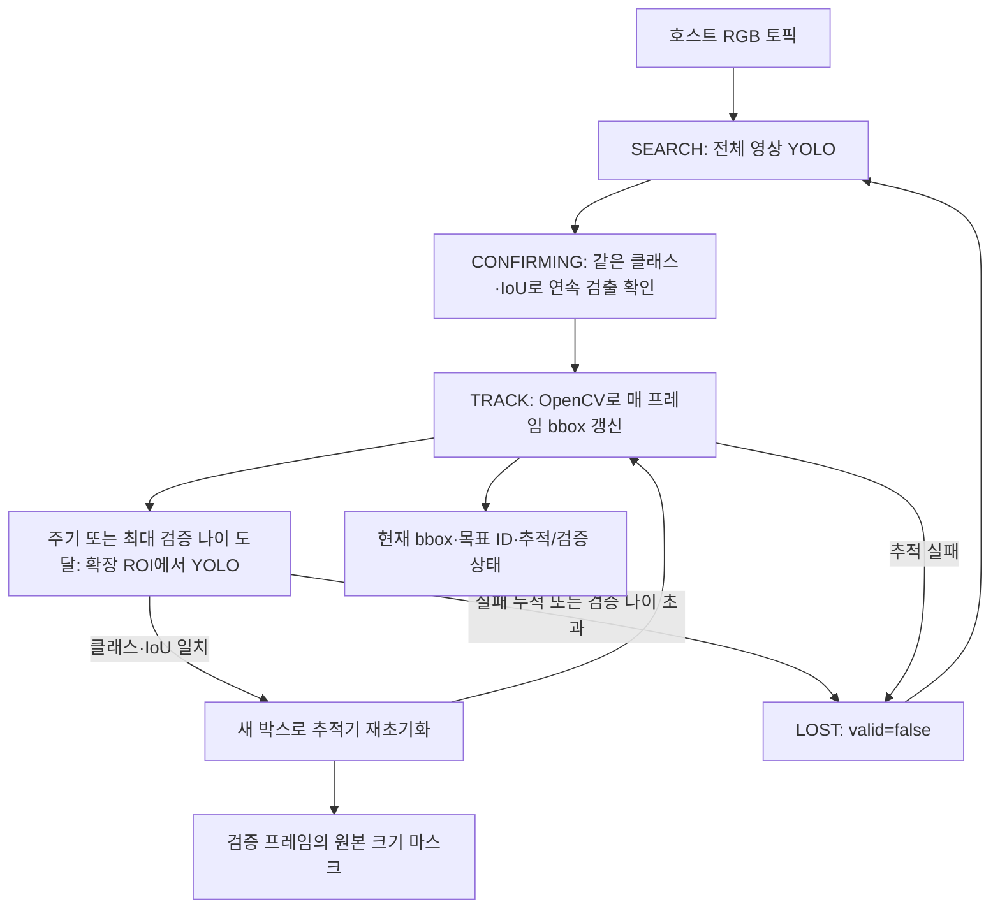

# 헤드 검출·추적 구현

전체 영상 YOLO 탐색 → OpenCV CSRT/KCF 추적 → 주기적 ROI YOLO 재검증 구조다.
한 컨테이너의 한 ROS 2 노드에서 YOLO와 OpenCV를 실행한다. 카메라·LiDAR 드라이버,
CameraInfo·TF·시간 동기화와 3D 위치 추정은 호스트의 별도 노드가 담당한다.
최신 설계에 맞춰 기본 모델 task는 **detect (YOLO11n bbox)**다. 선택적으로 YOLO-seg
가중치와 `task: segment`를 연결하면 검증 프레임의 마스크도 출력할 수 있다.

ARMS의 이전 `arms_detection_node.py`(`45af414` 직전)의 detect-then-track 상태 구조,
ROI 재검증, 재초기화 흐름을 참고해 새로 작성했다. 현재 ARMS main은 추적기 드리프트로
CSRT/KCF를 제거한 버전이다. 빨간 풍선용 HSV와 ARMS 메시지·제어 의존성은 가져오지 않았다.

## 범위와 현재 상태

- 포함: 순수 Python 상태 머신, YOLO adapter, CSRT/KCF adapter, ROS 2 노드·커스텀 메시지,
  raw/JPEG 입력, 디버그 영상, 파라미터·launch·Docker CPU/GPU 설정, 모델 없이 실행하는 테스트.
- 가중치: **미포함**. 학습·다운로드하지 않는다. 빈 경로/없는 파일이면 `WAITING_MODEL`로
  무효 결과를 발행한다. 나중에 로컬 `.pt` 파일을 연결하고 노드를 재시작한다.
- 후속 구현: LiDAR 위치 추정, SAM 손목 분할, depth 점군 생성, GraspNet, 팔 제어.
- 실제 센서·학습 모델의 성능과 ROS/Docker 전체 구동은 대상 PC에서 검증해야 한다.

## 파일 구조

```text
detection/
├── HEAD_DETECTION.md
├── head_detection_ws/src/
│   ├── robocup_detection_msgs/     # HeadTarget.msg (ament_cmake)
│   └── robocup_head_detection/     # ament_python
│       ├── robocup_head_detection/
│       │   ├── core.py            # SEARCH / CONFIRMING / TRACK / LOST
│       │   ├── backends.py        # YOLO·OpenCV adapter
│       │   ├── images.py          # row stride를 보존하는 영상 변환
│       │   └── node.py            # ROS 입력·출력·watchdog
│       ├── config/head_detection.yaml
│       └── launch/head_detection.launch.py
├── docker/                        # Dockerfile, CPU Compose, GPU override
├── models/                        # 추후 가중치 배치 (Git 제외)
└── tests/                         # 모델 없이 상태/좌표/추적 검증
```

## 알고리즘과 출력 유효성



| 상태 | 처리 | valid | measured |
|---|---|---|---|
| WAITING_MODEL | 모델 없음/로드 실패 | false | false |
| WAITING_IMAGE | 입력 없음·입력 timeout | false | false |
| SEARCH | 전체 영상에서 목표 탐색 | false | false (미검출) |
| CONFIRMING | 지정 클래스·IoU로 연속 검출 확인 | false | true |
| TRACK, YOLO 검증 프레임 | 검출 박스로 추적기 초기화/보정 | true | true |
| TRACK, 중간 프레임 | OpenCV 추적 박스 | true | false |
| LOST | 추적·재검증·timestamp·입력 처리 실패 | false | false |

초기 목표는 지정 클래스 후보 중 가장 높은 confidence로 선택한다. 이후 검증은 **같은
class_id와 IoU 임계값**을 모두 만족해야 한다. 여러 후보가 있으면 기존 박스와 IoU가 높은
후보를 우선한다. 다른 동일 클래스 물체와 겹치면 IoU만으로 정체성이 보장되지는 않는다.
외형 특징·3D 위치를 통한 대응은 이후 추가한다.

ROI는 bbox 중심을 기준으로 폭·높이를 `roi_margin`배 확장하고 영상 경계에서 자른다.
YOLO 결과는 crop offset을 더해 원본 RGB 픽셀 좌표로 복원한다. YOLO-seg 마스크도
crop 격자에서 복원해 원본 RGB 크기의 `mono8` 마스크로 발행한다.

추적 프레임은 새 마스크가 없으므로 **과거 마스크를 재발행하지 않는다**. `confidence`는
마지막 YOLO confidence이며 OpenCV 추적 품질 점수가 아니다. `last_verified_stamp`를
별도로 전달한다. `max_unconfirmed` 미만의 검증 실패는 `ROI_UNCONFIRMED`로 표시하며 잠시
추적을 유지하지만, 최대 검증 나이까지 실패하면 즉시 무효화한다.

추적 실패는 해당 프레임에서 무효 결과를 발행하고 다음 입력부터 전체 영상으로 재탐색한다.
재획득하면 새로운 목표 ID를 부여하며 기존 목표의 재식별로 취급하지 않는다.

## ROS 인터페이스

| 토픽 (기본값) | 타입 | 내용 |
|---|---|---|
| `/head_camera/color/image_raw` | `sensor_msgs/Image` | 입력; 실제 헤드 카메라 토픽으로 변경 |
| `/detection/head/target` | `robocup_detection_msgs/HeadTarget` | 원본 픽셀 bbox·클래스·ID·검증 timestamp·상태 |
| `/detection/head/target_mask` | `sensor_msgs/Image`, mono8 | valid인 YOLO 검증 프레임에만 발행; 원본 RGB 크기 |
| `/detection/head/debug_image` | `sensor_msgs/Image`, bgr8 | 구독자가 있을 때만 생성; best-effort |

`HeadTarget.header`와 마스크 header는 **촬영한 RGB header**다. 출력은 완료 시각으로 바꾸지 않는다.
선택적 segment 모드에서 소비자는 timestamp와 frame_id로 target/mask를 짝짓고 target의 `target_id`를 연결해야 한다.
마스크는 foreground 255/background 0이다. `valid && measured && mask_available`가 모두 true인
관측만 LiDAR 마스크 투영에 사용한다. 기본 detect 모드는 마스크가 없으며, 유효한 bbox를
사용하는 LiDAR 군집 선택을 별도 구현해야 한다. bbox 관측은 정밀 마스크 관측이 아니다.

입력은 best-effort, keep-last 1로 오래된 영상 누적을 줄인다. 타깃과 마스크는 reliable이다.
영상 header는 0보다 큰 단조 증가 timestamp가 필요하다. 입력 누락, 해상도 변경, 오래된 영상,
역행 timestamp를 검사한다. 추론 완료 시 너무 오래된 결과도 무효화한다.
동일 시각에 겹친 callback 결과의 timestamp를 중복 사용하지 않는다.

## 주요 설정

설정 파일: `head_detection_ws/src/robocup_head_detection/config/head_detection.yaml`.
값은 **초기 구현값이며 실측 확정값이 아니다**. 모든 파라미터는 시작 시 고정한다.
변경 후 재시작해야 하며 `ros2 param set`으로 중간에 상태 머신을 변경하지 않는다.

| 설정 | 기본 | 의미 |
|---|---:|---|
| target_class | 빈 문자열 | 모델의 클래스 이름. 빈 값이면 최초 최고 confidence 후보 선택 |
| confirm_frames | 3 | 동일 클래스·IoU 연속 확인 횟수 |
| tracker_type | CSRT | CSRT/KCF 중 선택 |
| redetect_interval | 5 | **처리한 프레임 수** 기준 YOLO 재검증 주기 |
| roi_margin | 2.0 | bbox 폭·높이 확장 배율 |
| match_iou | 0.25 | 같은 클래스 후보와 최소 IoU |
| max_unconfirmed | 2 | ROI YOLO 확인 실패 누적 한도 |
| max_verification_age | 0.5 s | source timestamp 기준 마지막 YOLO 검증 최대 나이 |
| max_frame_gap | 0.5 s | 이보다 긴 입력 간격이면 추적기를 초기화 |
| input_timeout | 1.0 s | 실제 경과 시간 기준 영상 입력 watchdog |
| max_input_age | 0.5 s | ROS clock 기준 오래된/미래 입력과 오래된 결과 거부 |
| task | detect | YOLO11n bbox. 선택적 YOLO-seg 모델은 segment로 변경 |

시뮬레이션·bag 재생은 센서 timestamp와 `/clock`을 맞추고 `use_sim_time:=true`로 실행한다.
실기체는 센서와 ROS clock의 시간 기준을 맞춘다. 5프레임 주기는 고정 5Hz를 의미하지 않는다.

## Docker 실행: Linux x86 CPU

호스트에는 Docker Engine과 Compose v2가 필요하다. ROS 센서 노드는 호스트에서 실행한다.
첫 구현 이미지의 CPU 추론은 기능 확인용이며 실시간 성능을 보장하지 않는다.

```bash
cd /home/projectsh/Documents/INHA/RoboCup/INHA-RoboCup-Home-2th-2027/detection/docker
docker compose -f compose.yaml build
docker compose -f compose.yaml up -d
docker compose -f compose.yaml logs -f head_detection
```

모델이 없으므로 영상 수신 시 `WAITING_MODEL`, 입력이 없으면 `WAITING_IMAGE` 상태가 나온다.
모델 파일이 나중에 준비되면 `detection/models/best.pt`에 놓고 다음처럼 실행한다.

```bash
ROBOCUP_MODEL=/models/best.pt docker compose -f compose.yaml up -d --force-recreate
```

컨테이너 내부 경로 `/models/best.pt`는 호스트 `detection/models/best.pt`에 대응한다.
코드·YAML은 읽기 전용 bind mount로 연결했다. 이를 수정한 뒤에는 다음 명령으로 재시작한다.

```bash
docker compose -f compose.yaml restart head_detection
```

모델 경로·device·ROS_DOMAIN_ID 같은 환경변수 변경은 `up -d --force-recreate`를 사용한다.
메시지 정의, Dockerfile, 의존성을 변경하면 이미지를 다시 build하고 컨테이너를 재생성한다.
호스트와 컨테이너의 ROS 배포판·메시지 정의·ROS_DOMAIN_ID를 맞춘다. `network_mode: host`와
Fast DDS UDP 설정을 사용하며 카메라 USB 장치를 컨테이너에 직접 넘기지 않는다.

```bash
docker compose -f compose.yaml down
```

## NVIDIA GPU 실행: Linux x86

호스트 NVIDIA 드라이버와 NVIDIA Container Toolkit이 필요하다. CUDA 12.1용 PyTorch wheel을
사용하는 별도 이미지로 빌드한다. **Jetson용 이미지는 아니다.** Jetson은 해당 JetPack·ARM64에
맞는 베이스 이미지와 PyTorch 환경을 별도로 구성해야 한다.

```bash
cd /home/projectsh/Documents/INHA/RoboCup/INHA-RoboCup-Home-2th-2027/detection/docker
docker compose -f compose.yaml -f compose.gpu.yaml build
ROBOCUP_MODEL=/models/best.pt docker compose -f compose.yaml -f compose.gpu.yaml up -d --force-recreate
docker compose -f compose.yaml -f compose.gpu.yaml logs -f head_detection
```

GPU 실행에서는 `ROBOCUP_DEVICE` 기본값이 `0`이다. CPU 구성의 기본은 `cpu`다.
`.engine` TensorRT 배포는 현재 이 구현의 범위에 포함하지 않았다.

## 호스트에서 ROS 메시지 확인 / 도커 없이 실행

호스트 ROS 소비 노드도 커스텀 메시지를 빌드해야 한다. ROS 2 Humble 환경에서:

```bash
cd /home/projectsh/Documents/INHA/RoboCup/INHA-RoboCup-Home-2th-2027/detection/head_detection_ws
source /opt/ros/humble/setup.bash
colcon build --packages-select robocup_detection_msgs robocup_head_detection --symlink-install
source install/setup.bash
ros2 topic echo /detection/head/target
```

도커 없이 추론 노드까지 실행하려면 해당 Python 환경에 PyTorch·Ultralytics·OpenCV contrib가
추가로 필요하다. OpenCV의 일반/기여/headless wheel은 같은 `cv2`를 사용하므로 중복 설치하지
않는다. Dockerfile은 Ultralytics 의존성이 설치한 일반 OpenCV를 제거한 뒤 contrib headless를
설치하고 CSRT/KCF API를 검사한다.

```bash
ros2 launch robocup_head_detection head_detection.launch.py model_path:=/absolute/path/best.pt device:=cpu
```

## 테스트

순수 상태 머신은 기본 Python으로 실행할 수 있다.

```bash
cd /home/projectsh/Documents/INHA/RoboCup/INHA-RoboCup-Home-2th-2027
PYTHONPATH=detection/head_detection_ws/src/robocup_head_detection python3 -m unittest discover -s detection/tests -p test_core.py -v
```

전체 adapter 테스트는 NumPy와 `opencv-contrib-python-headless==4.10.0.84`가 설치된 환경에서:

```bash
PYTHONPATH=detection/head_detection_ws/src/robocup_head_detection python3 -m unittest discover -s detection/tests -v
```

실제 OpenCV CSRT/KCF 초기화·업데이트, ROI 박스/마스크의 원본 격자 복원, padded RGB 변환,
누적 검증 실패·가림·timestamp 역행·모델 예외·stale mask 억제를 확인한다.
테스트용 검출 adapter는 학습 모델의 정확도나 실제 영상에서의 인스턴스 대응을 검증하지 않는다.

ROS pub/sub 테스트를 포함하려면 Humble과 빌드한 workspace를 source한 환경에서 같은 전체
테스트 명령을 실행한다. ROS가 없는 환경에서는 해당 테스트 하나만 skip한다.

2026-10-05 로컬 검증: ROS 패키지 두 개 colcon build 성공, 상태 머신·실제 CSRT/KCF adapter·
ROS pub/sub를 포함한 **18개 테스트 통과**, 모델 없이 ROS launch 기동 확인.
Docker 실행 도구가 없는 환경이므로 이미지 빌드·CPU/GPU 컨테이너 실행은 미검증이다.
학습 모델 및 실센서를 연결한 추론 성능도 아직 검증하지 않았다.

## 참고

- [ARMS 구조 참고](https://github.com/IN-AIR-KR/ARMS)
- [Ultralytics predict 입력·박스·마스크](https://docs.ultralytics.com/modes/predict/)
- [OpenCV CSRT](https://docs.opencv.org/4.x/d0/d02/classcv_1_1TrackerCSRT.html)
