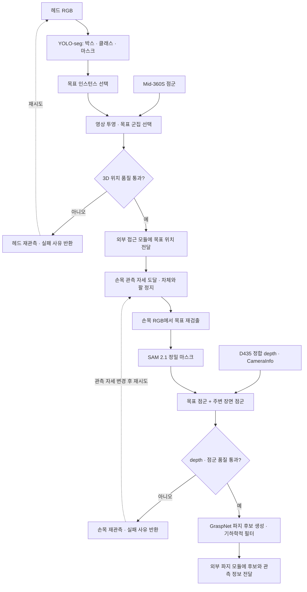

# Detection Workflow

헤드 카메라에서 물체를 찾고, 3D LiDAR로 접근용 위치를 추정한 뒤, 손목 카메라에서 정밀 분할·점군 생성·파지 후보 추정을 수행한다.

> **상태: 구현 전 설계 문서.** 손목 카메라는 **RealSense D435**를 사용한다. 관측 거리, depth 설정, 품질 임계값은 실제 물체를 측정한 뒤 확정한다. 아래 노드·토픽은 제안이며, 현재 실행 가능한 detection 패키지는 포함하지 않는다.

이 문서의 범위는 **물체 검출 → 인스턴스 분할 → 3D 위치 추정 → 손목 재관측 → 파지 후보 생성**이다. 차체·팔 이동과 Pick & Place 실행은 외부 모듈에 결과를 전달하는 지점만 설명한다.

## 1. 센서와 모델

| 단계 | 센서 / 모델 / 도구 | 역할 |
|---|---|---|
| 헤드 검출·분할 | 헤드 **D435f RGB**, Ultralytics **YOLO11s-seg** | 클래스, 바운딩박스, 인스턴스 마스크 생성 |
| 접근용 3D 위치 | **Livox Mid-360S**, `livox_ros_driver2`, ROS 2 `tf2`, **PCL** | 마스크에 대응하는 LiDAR 군집과 대표 위치 추정 |
| 손목 재검출 | 손목 **D435 RGB**, YOLO11s-seg | 접근 후 달라진 시점에서 같은 목표를 다시 선택 |
| 정밀 분할 | **SAM 2.1 Hiera Small**, `SAM2ImagePredictor` | 손목 이미지의 box/point prompt로 목표 마스크 정제 |
| 물체·장면 점군 | 손목 D435 depth, `realsense-ros` / `librealsense`, **Open3D** | RGB-depth 정합, 유효 depth 선택, 역투영·이상점 제거 |
| 파지 후보 | **GraspNet Baseline**, `graspnetAPI` | 6-DoF 파지 위치·방향, 그리퍼 폭, 접근 깊이, 점수 생성 |

초기 모델은 다음 조합으로 평가한다. 성능 수치는 실제 추론 PC에서 측정하며, 다른 로봇의 FPS를 목표 성능으로 사용하지 않는다.

| 모델 | 체크포인트 / 설정 | 선택 기준 |
|---|---|---|
| YOLO11s-seg | `yolo11s-seg.pt` | 탐색 단계의 검출과 마스크를 한 모델에서 생성. 부하가 크면 `yolo11n-seg.pt` 비교 |
| SAM 2.1 Small | `sam2.1_hiera_small.pt` + `configs/sam2.1/sam2.1_hiera_s.yaml` | 손목 정지 이미지의 정밀 분할. 추론 시간과 마스크 품질을 함께 평가 |
| GraspNet Baseline | `checkpoint-rs.tar` | RealSense 데이터로 학습한 공식 baseline을 초기 비교 기준으로 사용 |

YOLO 사전학습 모델의 클래스에 없는 대회 물체는 자체 검출·마스크 데이터로 fine-tuning한다. **SAM 2.1은 클래스 인식이나 depth 복원을 대신하지 않는다.**

## 2. 전체 흐름

### A. 헤드 RGB로 목표 찾기

1. YOLO-seg로 `class_id`, confidence, bbox, 인스턴스 마스크를 생성한다.
2. 임무에서 지정한 클래스와 관측 이력을 이용해 목표 인스턴스를 선택한다.
3. 박스·마스크를 **원본 RGB 좌표**로 복원하고 이미지 timestamp와 목표 ID를 함께 보존한다. 추론용 resize/letterbox 좌표를 그대로 LiDAR 투영에 사용하지 않는다.

같은 클래스의 물체가 여러 개면 클래스 이름만으로 목표를 선택하지 않는다. 접근 전후의 3D 위치와 영상 특징을 함께 사용하고, 구분이 모호하면 재관측한다.

### B. LiDAR로 접근용 3D 위치 추정

헤드 depth의 노이즈를 고려해 **LiDAR를 주 위치 센서**로 사용한다. 헤드 RGB-D는 품질이 확인된 조건에서만 비교·보조 입력으로 사용한다.

1. 외부 보정값과 `tf2`를 이용해 LiDAR 점을 헤드 color optical frame으로 변환한다.
2. 해당 RGB/`CameraInfo`에 맞게 영상에 투영하고, 목표 bbox와 마스크 내부의 점을 선택한다.
3. ROI 필터와 PCL 군집화를 적용한다. 테이블 등 **식별된 지지 평면**을 분리하고 목표 물체의 표면은 보존한다.
4. 기존 목표 위치, 군집 크기와 거리 일관성으로 목표 군집을 선택한다. bbox 내부 모든 점의 평균이나 가장 큰 군집만으로 결정하지 않는다.
5. 군집의 대표 위치, 점 수, 공간 분산, 관측 나이를 반환한다. 이 위치는 보이는 표면의 대표값이며 물체의 정확한 기하학적 중심이라고 가정하지 않는다.

정류된 핀홀 영상에서는 `u = fx·X/Z + cx`, `v = fy·Y/Z + cy`로 투영한다. 원시 왜곡 영상이라면 왜곡을 반영한 투영이 필요하다. 여기서 `Z`는 **카메라 전방 축 깊이**이며 LiDAR의 방사 거리와 구분한다.

작은 물체에 점이 부족하면 차체를 멈추고 짧게 누적해 재관측한다. 이동 중 누적은 odometry와 점별 시간 정보를 이용한 운동 보정이 필요하다. 최근 submap을 사용할 경우 좌표계·생성 시점·누적 구간을 확인하고, 오래된 점이나 같은 submap의 반복 사용을 새로운 독립 측정으로 취급하지 않는다.

**위치 품질이 부족하면 목표를 찾았다는 RGB 결과만 반환하고 3D 위치는 무효로 표시한다.** 필요하면 외부 접근 모듈이 지지면 형상을 기준으로 관측 위치를 바꾼다. LiDAR가 작은 물체를 항상 검출한다고 가정하지 않는다.

### C. 손목 D435로 다시 관측

외부 팔 모듈에 목표 3D 위치와 관측 요구사항을 전달한다. 카메라–물체 거리, RGB/depth 공통 시야, 팔 도달성, 손가락·테이블 가림을 만족하는 **관측 자세**를 선택한 뒤 차체와 팔을 정지한다.

- 초기 실측은 카메라–물체 거리 **30 / 40 / 50 cm**에서 수행한다. 최종 운영 거리는 측정 결과로 선택한다.
- 손목 RGB에서 YOLO를 다시 실행한다. 헤드에서 얻은 픽셀 bbox를 손목 이미지에 그대로 재사용하지 않는다.
- 헤드에서 추정한 3D 목표를 손목 영상에 투영해 재검출 후보와 연결한다. 시점 차이와 위치 불확실성을 고려한 ROI를 사용한다.
- 선택한 손목 bbox를 `SAM2ImagePredictor`의 box prompt로 사용한다. 필요하면 물체 내부/배경 point prompt로 마스크를 보정한다.

첫 구현은 정지 이미지의 SAM 분할로 시작한다. 연속 영상 추적이 필요하면 별도의 video predictor 경로를 평가하되, 헤드와 손목 사이의 목표 ID 대응은 별도로 처리한다.

### D. 유효 depth로 점군 생성

손목 RGB, RGB에 정합된 depth, 해당 격자의 `CameraInfo`를 동기화한다. **SAM 마스크가 좋아도 물체의 depth가 없으면 정밀 3D 관측에 성공한 것으로 판단하지 않는다.**

1. 실제 driver의 depth scale·encoding·stride를 확인하고 미터로 변환한다. `16UC1`이라는 이유만으로 고정된 `/1000`을 적용하지 않는다. `32FC1` 입력은 단위 계약을 확인한다.
2. 검증한 거리 범위의 유효 픽셀만 사용한다. 배경으로 튀는 depth와 경계의 혼합 픽셀을 제거한다.
3. 필요하면 disparity-domain spatial filter를 적용한다. Temporal filter는 정지 관측에서만 평가하고, 팔/차체 이동 또는 목표 변경 시 이력을 초기화한다.
4. RGB 마스크와 같은 격자의 intrinsics로 역투영한다. 정합·crop·resize 후의 격자에 맞는 intrinsics를 사용한다.
5. Open3D로 점군을 정리하고, 관측 시점의 TF로 지정된 고정 좌표계에 변환한다.

역투영은 `X = (u−cx)·Z/fx`, `Y = (v−cy)·Z/fy`, `Z = depth_m`이다. 센서 CAD 원점 대신 실제 depth/color optical frame과 보정값을 사용한다.

점군은 두 종류를 유지한다.

| 출력 | 용도 |
|---|---|
| **목표 물체 점군** | SAM 마스크와 유효 depth로 만든 목표 표면. 파지 후보의 목표 물체 대응 확인 |
| **주변 장면 점군** | 테이블·인접 물체를 포함한 작업 영역. 파지 후보의 그리퍼·접근 구간 충돌 검사 |

Hole filling으로 추정한 값은 실제 측정값과 구분한다. 큰 구멍을 메운 결과나 과거 EMA 값만 남은 영역을 관측된 표면처럼 사용하지 않는다. 여러 자세의 점군을 합칠 때는 각 timestamp의 팔 TF와 hand–eye 보정이 필요하다.

### E. GraspNet으로 파지 후보 생성

GraspNet Baseline에 검증된 작업 영역 점군을 입력하고, SAM에서 얻은 목표 점군에 대응하는 후보를 선택한다. 공식 demo의 입력 점 수는 기본 **20,000개**이며 전처리·샘플링을 구현해야 한다. 부족한 점을 반복 샘플링해도 새로운 기하 정보가 생기는 것은 아니다.

- 출력은 단일 잡는 각도가 아니라 **6-DoF pose, 그리퍼 폭, 접근 깊이, score**를 포함한 후보 집합이다.
- `graspnetAPI.GraspGroup`의 NMS·점수 정렬과 baseline의 `ModelFreeCollisionDetector`를 활용한다. 충돌 검사는 목표 점군만이 아니라 주변 장면을 포함한다.
- 실제 Piper의 그리퍼 형상·허용 폭, 카메라 마운트와 접근 방향을 반영한다. Baseline의 기본 손가락 치수와 파지 좌표계가 Piper에 맞는다고 가정하지 않는다.
- 예측 grasp frame을 실제 TCP frame으로 변환한다. 외부 팔 모듈에서 IK와 전체 로봇·경로 충돌 검사를 통과해야 실행할 수 있다.
- 손목 depth의 최소 거리·가림 때문에 **최종 파지 직전에도 depth를 계속 얻을 수 있다고 가정하지 않는다.** 관측 시점의 후보를 고정 좌표계에 저장하고 timestamp·유효기간을 전달한다. 물체 이동이나 장면 변경이 감지되면 재관측한다.

## 3. D435 관측 조건: 실측 후 확정

D435는 최대 해상도에서 최소 depth 거리가 약 28 cm이며 해상도·설정에 따라 Min-Z가 달라진다. 초기 비교 설정은 공식 권장 출발점인 **depth 848×480 @30 FPS**로 잡는다. RGB는 목표 크기와 추론 부하를 보고 결정한다. 이 설정과 촬영 거리는 정밀도 보장값이 아니다.

| 실측 항목 | 방법 / 기록 |
|---|---|
| 관측 거리 | 30 / 40 / 50 cm에서 같은 물체를 촬영하고 **실제 카메라 광학 원점 기준 거리**를 기록 |
| 대상 물체 | 대회 물체 중 무광·광택·어두운 물체와 작은 물체를 포함. 투명 물체는 별도 실패 조건으로 평가 |
| 유효 depth 비율 | 목표 마스크 내부에서 원래 유효하게 측정된 픽셀 비율. Hole filling·과거값 유지로 비율을 부풀리지 않음 |
| 노이즈·편향 | 정지 장면의 반복 측정 흔들림과 알려진 거리/형상에 대한 오차를 **따로** 기록 |
| 점군 품질 | 목표 점 수, 배경 혼입, 표면 구멍, 경계 이상점, 자세별 정합 오차 |
| 분할·목표 연결 | YOLO/SAM 마스크의 경계 품질, 같은 클래스 물체 간 오인, 헤드→손목 인스턴스 대응 성공률 |
| 전체 지연 | 촬영 timestamp부터 마스크·점군·파지 후보가 준비될 때까지의 지연 |
| 설정 비교 | raw vs spatial/temporal filter, depth preset, 해상도, 노출·IR projector 설정을 동일 장면에서 비교 |

RealSense Viewer와 `rosbag2`로 원본 영상·depth·`CameraInfo`·TF·관절 상태를 저장한다. LiDAR 시험은 원본 점군과 odometry, 선택된 군집을 함께 기록한다. 거리·조명·재질·카메라 설정·필터 상태를 실험 로그에 남긴다.

**관측 거리, confidence, 최소 점 수, 허용 분산, 동기화 오차, 관측 유효기간은 모두 TBD이다.** 실측으로 정한 기준을 통과한 경우에만 다음 단계에 결과를 전달한다. 반복 측정이 안정적이거나 EKF 공분산이 작아도 체계적인 보정 오차가 작다는 뜻은 아니다.

## 4. ROS 2 데이터 계약

현재 저장소의 **ROS 2 Humble**을 기준으로 설계한다. 아래 이름은 제안이며 실제 센서 namespace와 remap한다.

| 제안 인터페이스 | 데이터 | 필수 조건 |
|---|---|---|
| 헤드/손목 RGB 입력 | `sensor_msgs/Image` | 센서 timestamp, optical frame, 영상 크기 |
| 손목 정합 depth 입력 | `sensor_msgs/Image` + `CameraInfo` | RGB 마스크와 동일한 투영 격자, depth 단위·유효값 정의 |
| LiDAR 입력 | `sensor_msgs/PointCloud2` | 실제 frame_id, timestamp. 이동 누적 시 점별 시간/운동 보정 |
| `/detection/head/detections` | `vision_msgs/Detection2DArray` | 클래스·bbox·confidence·인스턴스 ID |
| `/detection/head/target_mask` | `sensor_msgs/Image` (`mono8`) | 원본 RGB 크기, 같은 관측 timestamp. 목표 ID는 동반 메타데이터로 연결 |
| `/detection/target_position` | `geometry_msgs/PointStamped` + 품질 메타데이터 | 목표 ID, 좌표계, 점 수·분산·관측 나이·유효 여부 |
| `/detection/wrist/target_mask` | `sensor_msgs/Image` (`mono8`) | 손목 RGB의 해당 목표 마스크 |
| `/detection/wrist/object_points` / `scene_points` | `sensor_msgs/PointCloud2` | 목표 점군과 장면 점군 분리, frame·관측 ID 일치 |
| `/detection/grasp_candidates` | 파지 후보 배열 **메시지 정의 예정** | 후보 ID, pose, width, approach depth, score, 목표 ID, 관측 timestamp·좌표계 |

`PoseArray`만으로는 그리퍼 폭과 score를 전달할 수 없으므로 파지 후보 메시지에 함께 담는다. 마스크·점군·후보에는 같은 관측 ID를 연결한다. 실패는 `TARGET_NOT_FOUND`, `INSUFFICIENT_LIDAR_POINTS`, `INVALID_DEPTH`, `STALE_OBSERVATION`, `NO_GRASP_CANDIDATE`처럼 원인을 구분해 반환한다.

보정·동기화의 기본 조건은 다음과 같다.

- 헤드 RGB–LiDAR 외부 보정과 손목 **eye-in-hand calibration**을 각각 수행한다. CAD 배치값은 초기값이며 실측 보정값을 대체하지 않는다.
- RGB-depth는 RealSense의 공장 보정 TF와 해당 스트림 `CameraInfo`를 사용한다. 같은 TF를 URDF와 driver가 중복 발행하지 않는다.
- RGB·depth·마스크를 시간 동기화하고 **추론 완료 시각 대신 촬영 시각**으로 TF를 조회한다. 서로 다른 장치의 clock offset도 확인한다.
- 실측에서 정한 이동 안정성 기준을 통과한 뒤 정밀 관측한다. `message_filters`의 시간 허용 폭은 실측으로 정한다.

## 5. 참고 팀에서 반영한 구조

[Inha-United@home](https://github.com/inha-united-athome)의 공개 코드·설정을 참고했다. 아래 내용은 참고 구조이며 이 저장소에 해당 패키지를 설치·포팅했다는 의미는 아니다.

| 참고 저장소 | 반영할 부분 | 적용 시 확인 |
|---|---|---|
| `inha_perception` | YOLO 검출, box-prompt SAM 2.1 분할, 정합 depth의 점군 변환을 분리 | 실제 코드의 모델·토픽과 README 기본값에 차이가 있음. 경로·namespace를 parameter화하고 인스턴스별 마스크 출력을 추가 |
| `get_seg_3d_coord` | 마스크 시각의 TF로 LiDAR/submap 투영 → bbox·마스크 선택 → PCL 군집화 → 위치 품질 기록 | 참고 설정의 군집 거리 `0.30 m`를 작은 파지 물체에 그대로 적용하지 않음. 실측으로 군집·필터 기준 결정 |
| `easy_handeye2` | ArUco 관측과 여러 팔 자세를 이용한 eye-in-hand 보정·검증 | RB-Y1/D405의 frame과 보정값을 복사하지 않고 Piper/D435에서 다시 측정 |
| `GraspGen_inha` | 필요할 때만 파지 추론을 실행하고, 점군을 기준 좌표계로 변환해 후보를 전달하는 구조 | 이번 기본 모델은 GraspNet. GraspGen은 향후 비교 후보이며 Piper 그리퍼에 대한 적합성 평가가 필요 |

참고 팀의 공개 하드웨어 구성은 **헤드 D435f + 팔 D405**이다. 우리 손목은 **D435**이므로 관측 거리와 depth 성능을 별도로 평가한다. `get_seg_3d_coord`와 파지 wrapper의 `inha_interfaces` 의존성도 이 저장소에 포함되어 있지 않다.

## 6. 현재 저장소와 구현 순서

2026-10-03에 확인한 `main` 기준으로 Tracer·Piper·센서 랙과 선택형 손목 카메라 모델이 포함되어 있다.

| 입력 | 현재 상태 | detection 연결에 필요한 작업 |
|---|---|---|
| 헤드 RGB/depth·Mid-360S | Gazebo 센서 모델 존재, ROS 브리지 미포함 | Image·CameraInfo·PointCloud2 브리지 또는 실제 driver 연결 |
| 손목 RGB/depth·점군 | `wrist_camera:=true` 옵션, 손목 URDF/광학 프레임과 `/wrist_camera/…` ROS 브리지 설정 존재 | Ubuntu 실구동·메시지 수신 검증, 실제 D435 보정, RGB-depth 정합 |
| 검출·분할·파지 후보 | 설계 단계 | 모델 wrapper, 품질 판정, 데이터 계약 구현 |

[손목 카메라 가이드](../HW/URDF/wrist_camera_description/README.md)의 Gazebo 모델은 핀홀 근사이며 실제 depth 노이즈를 재현하지 않는다. `/wrist_camera/depth/image_raw`와 RGB 토픽이 존재한다는 것만으로 정합된 depth라는 뜻은 아니다. 기존 CAD/시뮬레이션의 D435f 표기와 실제 손목 D435를 구분하고, 성능 판단은 실측 데이터로 수행한다. 헤드 센서의 상세 제약은 [센서 문서](../simulation/docs/SENSORS.md)를 참고한다.

구현은 다음 순서로 진행한다.

1. **센서 입력·보정:** 실제 driver 또는 헤드 센서 ROS 브리지 연결, 기존 손목 센서/TF·브리지 동작 확인, color-depth·LiDAR·hand–eye 검증.
2. **헤드 인식·위치:** YOLO-seg → 마스크와 LiDAR 대응 → 3D 목표 위치 및 실패 사유 출력.
3. **D435 실측:** 거리·설정별 원본 데이터를 수집하고 운영 조건·품질 임계값 결정.
4. **손목 정밀 인식:** 목표 재검출 → SAM 2.1 → 유효 목표/장면 점군 → 재관측 판정.
5. **파지 후보:** GraspNet 추론 → 그리퍼 형상·좌표 변환·장면 충돌 필터 → 후보 전달.

SAM 2는 현재 공식 요구사항이 Python ≥3.10, PyTorch ≥2.5.1이며 GraspNet Baseline은 PyTorch 1.6 기반 요구사항과 custom CUDA 연산자를 제시한다. 단일 Python 환경의 호환성을 가정하지 않고 **모델별 inference 프로세스/컨테이너를 분리**하는 구성을 검토한다. 실제 GPU·CUDA·ROS adapter의 호환성은 별도로 검증하고 사용한 commit과 환경 버전을 기록한다.

외부 접근 모듈은 목표 3D 위치와 품질을 받아 차체·팔을 관측 자세로 이동시킨다. 외부 파지 모듈은 후보를 받아 MoveIt 2 등으로 IK·전체 경로를 검사하고 Pick & Place를 실행한다. 주행 알고리즘, 배치 위치 계획, 그리퍼 제어는 이 문서의 구현 범위에 포함하지 않는다.

## References

### 모델 · 센서 · 도구의 원본 GitHub

| 기술 | 원본 저장소 |
|---|---|
| YOLO / YOLO11-seg | [ultralytics/ultralytics](https://github.com/ultralytics/ultralytics) |
| SAM 2 / SAM 2.1 | [facebookresearch/sam2](https://github.com/facebookresearch/sam2) |
| GraspNet Baseline | [graspnet/graspnet-baseline](https://github.com/graspnet/graspnet-baseline) |
| GraspNet API | [graspnet/graspnetAPI](https://github.com/graspnet/graspnetAPI) |
| GraspGen — 향후 비교 후보 | [NVlabs/GraspGen](https://github.com/NVlabs/GraspGen) |
| RealSense SDK / Viewer / depth filters | [realsenseai/librealsense](https://github.com/realsenseai/librealsense) |
| RealSense ROS 2 driver | [realsenseai/realsense-ros](https://github.com/realsenseai/realsense-ros) |
| Livox ROS driver 2 / SDK 2 | [Livox-SDK/livox_ros_driver2](https://github.com/Livox-SDK/livox_ros_driver2), [Livox-SDK/Livox-SDK2](https://github.com/Livox-SDK/Livox-SDK2) |
| PCL | [PointCloudLibrary/pcl](https://github.com/PointCloudLibrary/pcl) |
| Open3D | [isl-org/Open3D](https://github.com/isl-org/Open3D) |
| OpenCV — 투영·ArUco·hand–eye calibration | [opencv/opencv](https://github.com/opencv/opencv), [opencv/opencv_contrib](https://github.com/opencv/opencv_contrib) |
| easy_handeye2 원본 | [marcoesposito1988/easy_handeye2](https://github.com/marcoesposito1988/easy_handeye2) |
| ROS 2 TF / 시간 동기화 | [ros2/geometry2](https://github.com/ros2/geometry2), [ros2/message_filters](https://github.com/ros2/message_filters) |
| ROS 메시지 / 기록 도구 | [ros2/common_interfaces](https://github.com/ros2/common_interfaces), [ros-perception/vision_msgs](https://github.com/ros-perception/vision_msgs), [ros2/rosbag2](https://github.com/ros2/rosbag2) |
| Gazebo–ROS 브리지 | [gazebosim/ros_gz](https://github.com/gazebosim/ros_gz) |
| MoveIt 2 — 외부 실행 모듈 | [moveit/moveit2](https://github.com/moveit/moveit2) |

### Inha-United@home 구현 참고

- [조직 및 하드웨어 구성](https://github.com/inha-united-athome)
- [inha_perception](https://github.com/inha-united-athome/inha_perception) — [YOLO 노드](https://github.com/inha-united-athome/inha_perception/blob/main/perception/perception/yolo.py), [SAM 2.1·점군 노드](https://github.com/inha-united-athome/inha_perception/blob/main/perception/perception/groundedsam2.py)
- [get_seg_3d_coord](https://github.com/inha-united-athome/get_seg_3d_coord/tree/v0.5) — [LiDAR 마스크 투영](https://github.com/inha-united-athome/get_seg_3d_coord/blob/v0.5/src/point_selector.cpp), [실측·EKF 기록 흐름](https://github.com/inha-united-athome/get_seg_3d_coord/blob/v0.5/README.md)
- [easy_handeye2 팀 구성](https://github.com/inha-united-athome/easy_handeye2)
- [GraspGen_inha ROS wrapper](https://github.com/inha-united-athome/GraspGen_inha/tree/v0.5/scripts_RBY1)

### 제조사 사양 · 공식 문서

- [D435 사양](https://www.realsenseai.com/products/stereo-depth-camera-d435/), [D435f 사양](https://www.realsenseai.com/products/d435f-3/)
- [D400 권장 depth preset·해상도](https://dev.realsenseai.com/docs/d400-series-visual-presets/), [depth 후처리](https://github.com/realsenseai/librealsense/blob/master/doc/post-processing-filters.md)
- [Mid-360S 사양·근접 검출 제한](https://www.livoxtech.com/mid-360s/specs)
- [YOLO11 지원 모델](https://docs.ultralytics.com/models/yolo11/), [SAM 2 설치 요구사항](https://github.com/facebookresearch/sam2/blob/main/INSTALL.md), [GraspNet RGB-D demo](https://github.com/graspnet/graspnet-baseline/blob/main/demo.py)
