# MuJoCo Manipulation · 손목 관측에서 픽앤플레이스까지

> **Ubuntu 개발 PC용 독립 시뮬레이션 튜토리얼입니다.** 4cm 큐브의 탑다운 손목 관측 → GraspNet 1회 추론 → RViz 상위 50개 후보 확인 → MoveIt 계획 → MuJoCo 접촉 파지·배치를 재현합니다. 실제 로봇 구동과 Nav2·헤드 검출 연결은 별도 작업입니다.

로봇은 [공용 조립 URDF](../robot_description/robocup.urdf)를 사용하며, 메시와 CAD는 [HW/URDF](../../HW/URDF/README.md)를 참조합니다. 저장소 전체를 clone해야 합니다. Gazebo와 MuJoCo는 별도 실행 경로이므로 튜토리얼 실행 중 Gazebo/다른 ROS 관절 게시 노드는 종료합니다.

공용 URDF의 1번 관절 영점은 원본 Piper의 1.6 rad 자세입니다. 튜토리얼의 초기·접힘 자세와 관측 IK seed는
1번 관절값을 1.6 rad 빼서 기존 물리적 자세를 유지합니다. 보존된 점군·GraspNet 결과·성공 로그는 변경 전 모델의 기록입니다.
새 URDF와 설정에서는 기존 metadata의 모델 해시 검사가 거절하므로, [튜토리얼](docs/TUTORIAL.md)의 관측·점군 생성·Colab 추론 순서로 입력을 다시 생성하세요.

## 먼저 확인할 문서

| 알고 싶은 것 | 읽을 문서·파일 |
| --- | --- |
| 개발환경, 터미널별 명령, Colab, 오류 해결 | [전체 실행 튜토리얼](docs/TUTORIAL.md) |
| 제공하는 점군·포즈의 형식과 좌표계 | [입력·결과 파일 안내](data/README.md) |
| 성공한 GPU 추론 원본 | [Colab 노트북](colab/graspnet_wrist_camera.ipynb) / [사용법](colab/README.md) |
| 실제 성공 판정과 접촉·배치 수치 | [보존 성공 로그](reports/wrist_camera_grasp_execution_success.json) |
| 출처 commit, 환경, 파일 checksum | [provenance.json](docs/provenance.json) |
| 이 저장소 경로로 옮긴 뒤 확인한 범위 | [CPU 검증 기록](reports/repository_validation.json) |

## 구현 범위와 현재 상태

| 항목 | 상태·의미 |
| --- | --- |
| 4cm 큐브 물리 픽앤플레이스 | **원래 실행에서 PICK_AND_PLACE_PASS / DONE 확인** |
| 로봇·물체 중심 수평 거리 40cm | 고정 베이스의 초기 장면으로 설정 |
| 탑다운 손목 관측 | 카메라 optical frame을 물체 중심 위 30cm에 배치하는 관절 자세 계산 |
| 단일 관측 → GraspNet 1회 추론 | 제공 입력과 성공 후보를 보존, 추론은 Colab CUDA에서 수행 |
| 모델 폭 대신 실제 최대 개구 사용 | `--fixed-open-width`; 실제 큐브 적합성·IK·충돌·접촉 검사는 유지 |
| 네비게이션·실제 물체 검출 | 중심 좌표를 이미 알고 있다고 가정, 실제 연동은 미검증 |
| 실제 D435 / hand–eye calibration | 이상적 광선 점군과 URDF 장착 변환 사용, 실물은 미검증 |
| 모델 폭 과대 예측의 원인 | 통제 GPU 실험으로 확정하지 못함 |

원래 성공 기록의 예측 폭은 **77.503mm**, 실제 최대 개구는 약 **70mm**, 닫은 뒤 간격은 **39.069mm**였습니다. 들어 올리기 중 상대 위치 변화는 최대 **2.093mm**, 배치 오차는 **1.553mm**입니다. 이는 해당 설정의 한 실행이며 다른 물체의 성공률을 뜻하지 않습니다.

## 파일 구조

```text
simulation/mujoco/
├── README.md
├── requirements_success.txt       # 로컬 CPU Python 의존성
├── run_mujoco_moveit_bridge.py     # ROS 궤적·그리퍼 명령과 실제 물리 실행
├── run_wrist_observation.py        # 관측 자세 계획·이동
├── run_grasp_moveit.py             # 후보 검사·파지·lift·place 상태 머신
├── manipulation/                  # 공용 모델 변환·좌표계·접촉/형상 검사
├── launch/                        # MoveIt / robot_state_publisher
├── config/                        # 성공 장면·RViz·안전 판정 설정
├── scripts/                       # 점군 생성·결과 import·RViz 게시
├── colab/                         # 성공한 GPU 추론 원본
├── data/                          # 4cm 큐브 점군·원본 후보
├── docs/                          # 상세 방법론·출처
├── tests/                         # CPU 회귀 검사
├── tools/                         # 로컬 환경 확인
├── reports/                       # 보존 성공 로그, 실행 결과는 로컬 생성
└── simulation/generated/          # 실행 시 생성, Git에서 제외
```

`mid360_cloud.py`, `generate_mid360_cloud.py`는 손목 경로가 재사용하는 해시·변환·ROS snapshot helper를 포함합니다. 현재 안내 경로의 입력 센서는 손목카메라이며 LiDAR 추론 경로를 실행하는 것이 아닙니다.

## 시스템 흐름

```mermaid
flowchart LR
    A[상위 인식에서 물체 중심 수신 가정] --> B[중심 앞 40cm 정지 장면]
    B --> C[손목카메라 탑다운 관측 자세로 이동]
    C --> D[보이는 표면의 3D 점군 1회 생성]
    D --> E[Colab GraspNet 1회 추론]
    E --> F[RViz 원본 상위 50개 확인]
    F --> G[실제 개구 적합성 · IK · 충돌 · 배치 검사]
    G --> H[접근 · 닫기 · 양손가락 접촉 확인]
    H --> I[20cm lift · 상대 자세 안정성 확인]
    I --> J[왼쪽 10cm 배치 · 열기 · 접힘 복귀]
```



GraspNet은 2D 픽셀 좌표가 아닌 **카메라에서 보이는 표면의 3D XYZ 점군**을 받습니다. 카메라 프레임, 물체 프레임, 그리퍼 TCP는 서로 다르므로 metadata의 강체 변환과 `target_tcp()`의 depth 오프셋을 적용합니다. 관측 자세가 접근 시작 자세이며 기존 20cm 참고 pre-grasp를 별도 경유하지 않습니다.

## ROS 인터페이스

| 이름 | 형식 | 방향·의미 |
| --- | --- | --- |
| `/arm_controller/follow_joint_trajectory` | `control_msgs/action/FollowJointTrajectory` | MoveIt → 브리지, 팔 6관절 궤적 |
| `/joint_states` | `sensor_msgs/msg/JointState` | 브리지 → MoveIt, 실제 관절 상태 |
| `/simulation/grasp_status` | `std_msgs/msg/String` 안의 JSON | 단계·시뮬레이션 시간·world 변환·접촉력·개구·실패 |
| `/gripper_command` | `std_msgs/msg/Float64` | 닫기/열기 목표; **joint7 변위(0~0.035m)**, 전체 폭과 구분 |
| `/base_state` | `std_msgs/msg/String` | `MOVING` / `STOPPED`, 접힌 자세 인터록 |
| `/manipulation_stage` | `std_msgs/msg/String` | 실행 단계 전달 |
| `/grasp_targets` | `geometry_msgs/msg/PoseArray` | MuJoCo 목표 마커 |

손가락 joint8은 joint7의 반대 방향입니다. 전체 개구는 메시의 실제 안쪽 표면으로 측정하며 명령값을 전체 폭으로 해석하지 않습니다.

## 개발환경과 실행 순서

검증된 로컬 환경은 Ubuntu 22.04.5 / Python 3.10.12 / ROS 2 Humble / MoveIt 2.5.10 / MuJoCo 3.3.7입니다. 로컬 NVIDIA GPU는 필요 없습니다. ROS 저장소 등록부터 설명한 [환경 구축](docs/TUTORIAL.md#4-개발환경-구축--로컬-nvidia-gpu-불필요)을 먼저 완료합니다.

저장소 루트에서:

```bash
cd simulation/mujoco
source /opt/ros/humble/setup.bash
/usr/bin/python3 -m venv --system-site-packages .ros_venv
source .ros_venv/bin/activate
python -m pip install -r requirements_success.txt
python tools/check_success_environment.py
python run_mujoco_moveit_bridge.py --prepare-only
```

**이후 각 터미널에서 공통 초기화**합니다. clone 위치가 다르면 첫 줄만 변경합니다.

```bash
cd "$HOME/INHA-RoboCup-Home-2th-2027/simulation/mujoco"
source /opt/ros/humble/setup.bash
source .ros_venv/bin/activate
export ROS_LOG_DIR="$PWD/reports/ros_logs"
```

| 터미널 | 역할 | 종료·대기 기준 |
| --- | --- | --- |
| 1 | MuJoCo 브리지 | viewer ready 이후 계속 유지 |
| 2 | MoveIt | 터미널 1 준비 후 계속 유지 |
| 3 | 손목 관측 이동 → 확인 후 파지 실행 | `WRIST_OBSERVATION_READY` 확인 후 다음 단계 |
| 4 | 상위 50개 후보 게시 | RViz를 보는 동안 유지 |
| 5 | RViz | 후보·입력 확인 |

### 터미널 1 · MuJoCo

```bash
python run_mujoco_moveit_bridge.py
```

### 터미널 2 · MoveIt

```bash
ros2 launch launch/moveit_mujoco.launch.py
```

### 터미널 3 · 손목 관측

```bash
python run_wrist_observation.py
```

### 터미널 4 · 원본 상위 50개 후보 게시

```bash
python scripts/publish_grasp_poses.py --raw --top 50 \
  --grasps data/grasps/cube_wrist_camera/grasps.json \
  --metadata data/pointclouds/cube_wrist_camera/metadata.json \
  --cloud data/pointclouds/cube_wrist_camera/points.npy
```

### 터미널 5 · RViz

```bash
rviz2 -d config/wrist_camera_grasps.rviz
```

### 터미널 3 · 확인 후 파지와 배치

```bash
python run_grasp_moveit.py --fixed-open-width \
  --grasps data/grasps/cube_wrist_camera/grasps.json \
  --metadata data/pointclouds/cube_wrist_camera/metadata.json \
  --result reports/wrist_camera_grasp_execution_latest.json
```

결과 JSON에서 `PICK_AND_PLACE_PASS`와 `DONE`을 확인합니다. 재실행은 터미널 1·2를 종료하고 처음부터 시작합니다. `Stereo is NOT SUPPORTED`는 RViz 입체 표시 경고이며 이 메시지만으로 파지 실패를 뜻하지 않습니다.

## 새 Colab 추론과 점군 변경

제공된 포즈로 먼저 재현할 수 있습니다. 직접 추론하려면 [Colab 사용법](colab/README.md)을 따라 입력 ZIP을 업로드하고 공식 체크포인트를 별도로 받습니다. 장면·물체·관측 자세가 달라지면 기존 포즈를 재사용하지 않고 `generate_wrist_camera_cloud.py --live`로 입력을 재생성합니다. 자세한 import와 좌표계 검사는 [튜토리얼](docs/TUTORIAL.md#6-선택-경로-b--colab에서-직접-한-번-추론)에 있습니다.

## 검증·문제 해결·협업

```bash
python -m unittest discover -s tests -v
```

CPU 테스트는 카메라 관측/FOV/가림, 좌표 변환, 실제 개구 적합성, ROS 상태 직렬화, 궤적 한계, planning scene attachment 등을 검사합니다. 전체 물리 파지는 GUI/ROS 실행으로 별도 확인합니다. 실패별 로그 위치와 조치는 [문제 해결](docs/TUTORIAL.md#8-문제-해결)을 참고합니다.

저장소 갱신과 Git 운영은 [루트 README](../../README.md#문서와-결과를-갱신할-때)를 따릅니다. 공용 URDF·HW 자산은 여기서 복제하거나 수정하지 않습니다. 가중치, ROS 로그, 생성 모델, 가상환경은 Git에 올리지 않습니다. 설치 확인·시뮬레이션 검증·실물 보정을 구분해 기록합니다.
